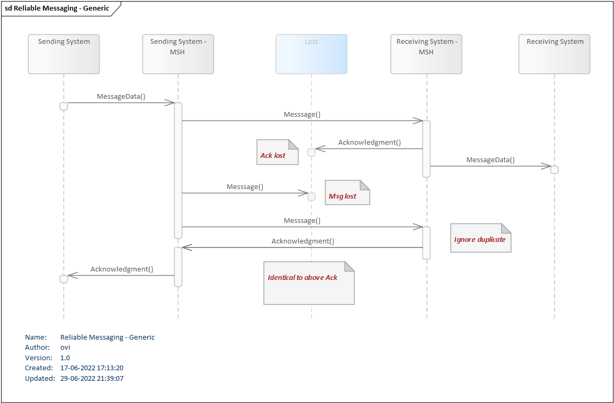

# Governance for Reliable Messaging in general

**Table of contents**

* [2 Reliable Messaging in general](#2-reliable-messaging-in-general)
  * [2.1 Generic ruleset governing the principles of Reliable Messaging](#21-generic-ruleset-governing-the-principles-of-reliable-messaging)
  * [2.2 Different Reliable Messaging scenarios](#22-different-reliable-messaging-scenarios)
    * [2.2.1 Scenario #1 - Normally successful unsolicited message or request message flow with acknowledgement request](#221-scenario-1---normally-successful-unsolicited-message-or-request-message-flow-with-acknowledgement-request)
    * [2.2.2 Scenario #2 - Duplicate an unchanged message with a positive acknowledgement request](#222-scenario-2---duplicate-an-unchanged-message-with-a-positive-acknowledgement-request)
    * [2.2.3 Scenario #3 - (Re) Sending Unchanged Message](#223-scenario-3---re-sending-unchanged-message)
    * [2.2.4 Scenario #4 - Message is sent normally, acknowledgement is lost along the way](#224-scenario-4---message-is-sent-normally-acknowledgement-is-lost-along-the-way)
    * [2.2.5 Scenario #5 - (Re-) Sending Modified Message](#225-scenario-5---re--sending-modified-message)

## 2 Reliable Messaging in general

Reliable Messaging is the way to secure that important information sent through messaging is handled thoroughly and either is sent from the Sending EcoSystem, the Sending Application and its MSH, to a Receiving EcoSystem, the Receiving Application and its MSH, or is handled safely manually. In every part of a message chain, something goes wrong and Reliable Messaging is developed to handle that.

A message sent from the Sending EcoSystem to the intended Receiving EcoSystem can be well received but the returned acknowledgement can be lost.

When discovering that the Sending EcoSystem after a well-agreed mutual time hasn't received the acknowledgement, it therefore has to resend the message.

That message can be lost and again the Sending EcoSystem will not know whether the message has been received or not.

It will then have to resend the message again. This time it will be received and acknowledged as before and the acknowledgement will eventually reach the original Sending EcoSystem and the message transaction will be fulfilled.

The Receiving EcoSystem will in the last event recognize the message as a duplicate and will return exactly the same acknowledgement content as the first time it received the message.

Any of these events can happen over time and therefore Reliable Messaging defines the ruleset used to govern these events.
A generic model for Reriable Messaging is shown in <a href="#Fig1">Figure 1</a>. 
<figure style="margin-left: 0px; margin-right: 0px; width: 100%;">

<figcaption text-align="left"><b>Figure 1: Generic Reliable Messaging Model </b></figcaption>
</figure>
 

MedCom FHIR Messaging uses Reliable Messaging.

A key part of the Messaging Network is to provide funcionality for Reliable Messaging.

Sending and Receiving EcoSystems when acting in FHIR Messaging scenarios **SHALL** support the Reliable Messaging scenarios outlined in the following section.

These scenarios are laid out as generic scenarios and later specified as how they will work out in a VANSEnvelope context and as how they will work out in a MedCom FHIR Messaging context.

## 2.1 Generic ruleset governing the principles of Reliable Messaging

|Generic ruleset governing the principles of Reliable Messaging|
|:---|
| A Sending EcoSystem **SHALL** send a Message with a flag indicating that it expects an Acknowledgement on the Message|
| A Sending EcoSystem **SHALL** be able to handle an unacknowledged Message|
| A Sending EcoSystem **SHALL** resend the Message, when the expected Acknowledgement is not received within a time limit of 15 minutes|
| A Sending EcoSystem **SHALL** change the MessageEnvelopeId and the MessageSentTime of a resent Message|
| A Sending EcoSystem **SHALL NOT** resend the Message more than 2 times, when the expected Acknowledgement is not received|
| A Receiving EcoSystem **SHALL** return an Acknowledgement on a received Message with a flag indicating that it expects an Acknowledgement on the Message|
| A Receiving EcoSystem **SHALL** be able to receive a Message as a duplicate|
| A Receiving EcoSystem **SHALL NOT** present the end-user for a duplicate of a Message|
| A Receiving EcoSystem **SHALL** change the MessageEnvelopeId and the MessageSentTime of a resend Acknowledgement|
| A Receiving EcoSystem **SHALL** return the same Acknowledgement content on a received Message as it returned on the first received copy of the Message|

 

A specific ruleset for respectively the MedCom FHIR Message and the VANSEnvelope will be explained later in this Governance.

| Links for specific ruleset of Reliable Messaging|
|:---|
|[Reliable Messaging using VANSEnvelope](032_Reliable_Messaging-VANSEnvelope.md)|
|[Reliable Messaging using MedCom FHIR Messaging](043_Reliable_Messaging-FHIR.md)|

## 2.2 Different Reliable Messaging scenarios

This section describes the different types of Reliable Messaging scenarios in generic terms. For specific handling of these scenarios for VANSEnvelope and FHIR Messages, please see the description in the detailed sections of the respective chapters for these subjects.

The different types of Reliable Messaging scenarios are:

* Scenario #1 - Normally successful unsolicited message or request message flow with an acknowledgement request
* Scenario #2 - Duplicate an unchanged message with a positive acknowledgement request
* Scenario #3 - (Re-)Sending Unchanged Message
* Scenario #4 - Message is sent normally, acknowledgement is lost along the way
* Scenario #5 - (Re-)Sending Modified Message

### 2.2.1 Scenario #1 - Normally successful unsolicited message or request message flow with acknowledgement request 

An unsolicited message or request message is sent with a new request for a positive acknowledgement from the Sending EcoSystem to a Receiving EcoSystem.

The Receiving EcoSystem **SHALL** always send a positive acknowledgement to the Sending EcoSystem.

### 2.2.2 Scenario #2 - Duplicate an unchanged message with a positive acknowledgement request 

Duplication of an unchanged message can be done in one of the following ways:

* An error may have occurred in the flow from the Sending EcoSystem to the Receiving EcoSystem with subsequent duplication of a message in scenario 1a.
* The Sending EcoSystem may inadvertently send a duplication of the message

The messages are completely identical and as a consequence the message with a request for positive acknowledgement arrives at the Receiving EcoSystem more than once.

The Receiving EcoSystem **SHALL** ignore the contents of the duplicate instances of the message but **SHALL** acknowledge a duplicate message in the same way as the original message.

A positive acknowledgement may not be sent first and then a negative acknowledgement or vice versa.

The Receiving EcoSystem **SHALL** never display several instances of a message in a message overview but **SHALL** log into a system log where the reception of a duplicate message has taken place.

If the Sending EcoSystem of the message has received acknowledgement already after the Receiving EcoSystem's acknowledgement of a message's first instance, the Sending EcoSystem **SHALL** similarly ignore the duplicate instances of the acknowledgement.

The Sending EcoSystem **SHALL** never display multiple instances of the same acknowledgement in a message summary but **SHALL** log into a system log where the acknowledgement of a duplicate has taken place.

### 2.2.3 Scenario #3 - (Re) Sending Unchanged Message

Correct retransmission of a message.

The Sending EcoSystem **SHALL** form a new envelope with a new ID and time of dispatch.

Since there has been no change in the letter section, the rest of the message **SHALL** remain identical.

The message **SHALL** sent and acknowledged as a completely new message according to Scenario #1 or Scenario #2.

Re-dispatches are always done manually and **SHALL** be in accordance with the normal response time for the specific message flow.

### 2.2.4 Scenario #4 - Message is sent normally, acknowledgement is lost along the way

As Scenario #1, but where acknowledgement is lost along the way from the Sending EcoSystem to the Receiving EcoSystem.

The shipping pattern is like Scenario #3.

### 2.2.5 Scenario #5 - (Re-) Sending Modified Message 

If the content of the letter part is changed, the message **SHALL** be considered a completely new message with the consequent change of both EnvelopeId, LetterId and timestamp, if relevant.

Resubmissions **SHALL** then always be done manually.

For historical reasons, there has been no requirement to use positive acknowledgements for some of MedComs old Messaging Standards, which is why Scenario #1 can in practice be run as Scenario #2.

The Sending EcoSystem may therefore experience that there is no acknowledgement of a message, and it is not recommended to make program logic that sends messages.

For a number of the old MedComs Messaging Standards, however, there is an explicit requirement for a positive acknowledgement, see the documentation for the individual standards if this is the case.

<a href="https://svn.medcom.dk/svn/releases/MedComs%20Standardkatalog.xlsx" target="_blank">Link til MedComs Standard Catalogue.</a> 
 
 >Note: The standard cataloge is only available i danish.  

| Links for specific ruleset of Reliable Messaging|
|:---|
|[Reliable Messaging in VANSEnvelope](032_Reliable_Messaging-VANSEnvelope.md)|
|[Reliable Messaging in MedCom FHIR Messaging](043_Reliable_Messaging-FHIR.md)|
