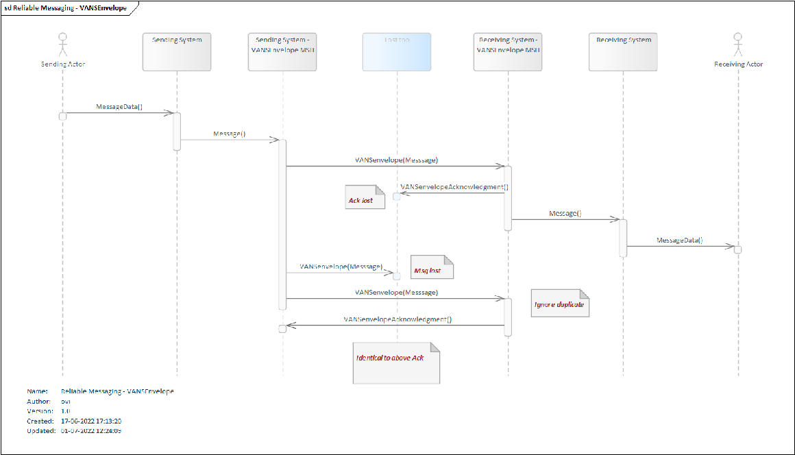
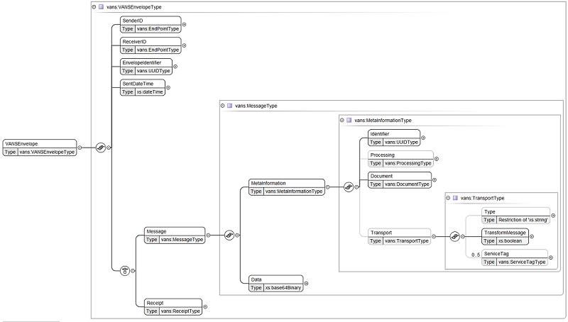
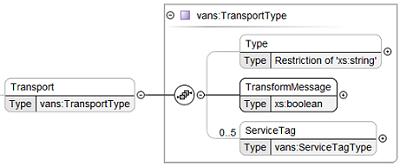
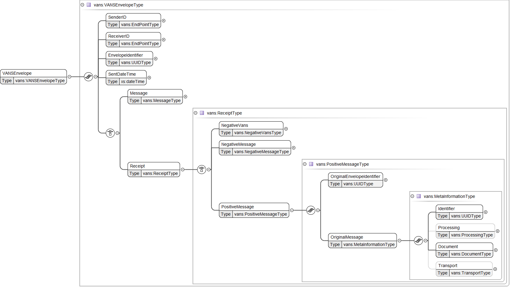

# Reliable Messaging using VANSEnvelope

Reliable Messaging in VANSEnvelope follows the principles laid out in [Reliable Messaging in general](/assets/documents/020_Governance-for-Reliable-Messaging-in-general.md)

The Reliable Messaging Model and how the flow is laid out using VANSEnvelope is shown below:

<figure style="margin-left: 0px; margin-right: 0px; width: 100%;">

<figcaption text-align="left"><b>Figure 1: Reliable Messaging - VANSEnvelope </b></figcaption>
</figure>
 

When Reliable Messaging is implemented , the Receiver **SHALL** check the incoming EnvelopeIdentifier and Message/MetaInformation/Identifier (hereafter MessageIdentifier) against a cache of previously received VANSEnvelopes. The correct action to take depends on what is received:

| Case                                                            | Description                |
|:----------------------------------------------------------------|:---------------------------|
| Both EnvelopeIdentifier and MessageIdentifier have not been received       | This is the normal case, and the message **SHALL** be processed            |
| Both EnvelopeIdentifier and MessageIdentifier have already been received   | The original VANSEnvelope server may either reprocess the message, or reject the message|
| MessageIdentifier has already been received, but EnvelopeIdentifier is new | The original VANSEnvelopeAcknowledgement has been lost (failed to return to the request issuer) and thus the previously received Message in a VANSEnvelope has been resubmitted with a new EnvelopeIdentifier for processing again. The original VANSEnvelopeAcknowledgement **SHALL** be resent|
| The EnvelopeIdentifier has already been received, but the MessageIdentifier is new | This is an error - EnvelopeIdentifier values **SHALL** never be reused. Receiver **MAY** return a Negative VANSEnvelopeAcknowledgement|

## Different Reliable Messaging scenarios using VANSEnvelope

This section provides a description of the different types of Reliable Messaging scenarios.

- Scenario #1 - Normally successful unsolicited  VANSEnvelope or request message flow with VANSEnvelopeAcknowledgement request
- Scenario #2 - Duplicate of an unchanged VANSEnvelope with a positive VANSEnvelopeAcknowledgement request
- Scenario #3 - (Re-)Sending Unchanged VANSEnvelope
- Scenario #4 - VANSEnvelope is sent normally, VANSEnvelopeAcknowledgement is lost along the way
- Scenario #5 - (Re-)Sending Modified VANSEnvelope

### Scenario #1 - Normally successful unsolicited  VANSEnvelope or request VANSEnvelope flow with VANSEnvelopeAcknowledgement request (Google translated)

An unsolicited  VANSEnvelope is sent with a new request for a positive VANSEnvelopeAcknowledgement from the Sending System to a Receiving System.

The Receiving System **SHALL** always send a positive VANSEnvelopeAcknowledgement to the Sending System.

### Scenario #2 - Duplicate of an unchanged VANSEnvelope with a positive VANSEnvelopeAcknowledgement request (Google translated)

Duplication of an unchanged VANSEnvelope can be done in one of the following ways:

- An error may have occurred in the flow from the Sending System to the Receiving System with subsequent duplication of a VANSEnvelope in scenario 1a.
- The Sending System may inadvertently send a duplicate of VANSEnvelope

The VANSEnvelopes are completely identical and as a consequence the VANSEnvelope with request for positive VANSEnvelopeAcknowledgement arrives at the Receiving System more than once.

The Receiving System **SHALL** ignore the contents of the duplicate instances of the VANSEnvelope, but **SHALL** acknowledge a duplicate VANSEnvelope in the same way as the original VANSEnvelope.

A positive VANSEnvelopeAcknowledgement may not be sent first and then a negative VANSEnvelopeAcknowledgement or vice versa.

The Receiving System **SHALL** never display several instances of a VANSEnvelope in a VANSEnvelope overview, but **SHALL** log in a system log that reception of a duplicate VANSEnvelope has taken place.

If the Sending System of the VANSEnvelope has received VANSEnvelopeAcknowledgement already after the Receiving System's VANSEnvelopeAcknowledgement of a VANSEnvelope's first instance, the Sending System **SHALL** similarly ignore the duplicate instances of the VANSEnvelopeAcknowledgement.

The Sending System **SHALL** never display multiple instances of the same VANSEnvelopeAcknowledgement in a VANSEnvelope summary, but **SHALL** log in a system log that VANSEnvelopeAcknowledgement of a duplicate has taken place.

### Scenario #3 - (Re) Sending Unchanged VANSEnvelope (Google translated)

Correct retransmission of a message A.

The Sending System **SHALL** form a new VANSEnvelope with a new ID and time of dispatch.

Since there has been no change in the Message content section, the rest of the VANSEnvelope **SHALL** remain identical.

The VANSEnvelope **SHALL** be sent and VANSEnvelopeAcknowledged as a completely new VANSEnvelope according to Scenario #1 or # 1b.

Re-dispatches **SHALL** always done manually and **SHOULD** be in accordance with the normal response time for the specific VANSEnvelope flow.

### Scenario #4 - VANSEnvelope is sent normally, VANSEnvelopeAcknowledgement is lost along the way (Google translated)

As Scenario #1, but where VANSEnvelopeAcknowledgement is lost along the way from the Sending System to the Receiving System.

The shipping pattern is like Scenario #3.

### Scenario #5 - (Re-) Sending Modified Message (Google translated)

If the content of the Message content part is changed, the VANSEnvelope is considered a completely new VANSEnvelope and consequently change of both EnvelopeIdentifier, MessageIdentifier and timestamp **SHALL** be made, where relevant.

Resubmissions **SHALL** always done manually.

## VansEnvelope Reliable Messaging Elements

### VansEnvelope Reliable Messaging Message Elements

A VansEnvelope consists of the following elements:

<figure style="margin-left: 0px; margin-right: 0px; width: 100%;">

<figcaption text-align="left"><b>Figure 2: Reliable Messaging - reliable vansenvelope schema </b></figcaption>
</figure>
 

A VansEnvelope's Reliale Messaging part can be found in the VANSEnvelope/Message/MetaInformation/Transport/Type-element:

<figure style="margin-left: 0px; margin-right: 0px; width: 100%;">

<figcaption text-align="left"><b>Figure 3: Reliable Messaging - reliable vansenvelope type </b></figcaption>
</figure>
 

Reliable Messaging in VANSEnvelope is the default mode, but can explicitly be turned on and off by setting this VANSEnvelope/Message/MetaInformation/Transport/Type-element to "reliable" or "unreliable".

In FHIR Messaging this element **SHALL** be "reliable" or left in default mode.

### VansEnvelope VANSEnvelopeAcknowledgement Reliable Messaging Elements

When "reliable" the receiver of the VANSEnvelope **SHALL** send a VANSEnvelopeAcknowledgement return to the original Sender.

A VANSEnvelopeAcknowledgement consists of the following elements:

<figure style="margin-left: 0px; margin-right: 0px; width: 100%;">

<figcaption text-align="left"><b>Figure 4: Reliable Messaging - reliable vansenvelope acknowledgement </b></figcaption>
</figure>
 

| Links for Reliable Messaging|
|:---|
|[Reliable Messaging in general](Reliable_Messaging-In-General.md)|
|[Reliable Messaging in MedCom FHIR Messaging](Reliable_Messaging-FHIR.md)|
