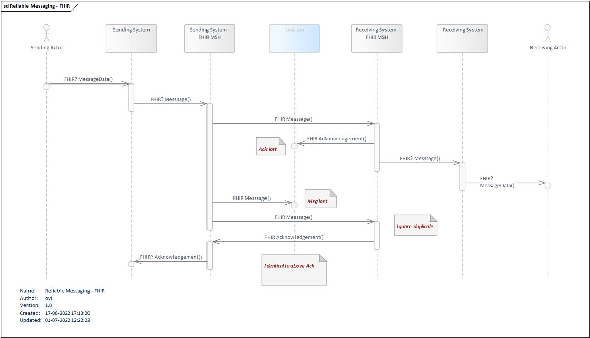

# Reliable Messaging using MedCom FHIR Messaging
**Table of contents** 
* [1 MedCom FHIR Reliable Messaging Model](#1-medcom-fhir-reliable-messaging-model)
    * [1.1 Different Reliable Messaging scenarios](#11-different-reliable-messaging-scenarios)
        * [1.1.1 Scenario #1 - Normally successful unsolicidated message or request message flow with acknowledgement request](#111-scenario-1---normally-successful-unsolicidated-message-or-request-message-flow-with-acknowledgement-request)
        * [1.1.2 Scenario #2 - Duplicate an unchanged message with a positive acknowledgement request](#112-scenario-2---duplicate-an-unchanged-message-with-a-positive-acknowledgement-request)
        * [1.1.3 Scenario #3 - (Re) Sending Unchanged Message](#113-scenario-3---re-sending-unchanged-message)
        * [1.1.4 Scenario #4 - Message is sent normally, acknowledgement is lost along the way](#114-scenario-4---message-is-sent-normally-acknowledgement-is-lost-along-the-way)
        * [1.1.5 Scenario #5 - (Re) Sending Modified Message](#115-scenario-5---re--sending-modified-message)

Reliable Messaging in MedCom FHIR Messaging follows the principles laid out in [Reliable Messaging in general](020_Governance-for-Reliable-Messaging-in-general.md)

The Reliable Messaging Model and how the flow is laid out using FHIR is shown in <a href="#Fig1">Figure 1</a>.

<figure style="margin-left: 0px; margin-right: 0px; width: 100%;">

<figcaption text-align="left"><b>Figure 1: Reliable Messaging - FHIR </b></figcaption>
</figure>
 

When reliable messaging is implemented , the Receiver **SHALL** check the incoming Bundle.id and MessageHeader.id against a cache of previously received messages.

The correct action to take depends on what is received:

 

| Case                                                            | Description                 |
|:----------------------------------------------------------------|:---------------------------|
| Both Bundle.id and MessageHeader.id have not been received      | This is the normal case, and the message **SHALL** be processed            |
| Both Bundle.id and MessageHeader.id have already been received  | The original response has been lost (failed to return to the request issuer), and the original response **SHALL** be resent|
| MessageHeader.id has already been received, but Bundle.id is new | A previously seen message has been resubmitted for processing again. The server may either reprocess the message, or reject the message|
| The Bundle.id has already been received, but the MessageHeader.id is new | This is an error - Bundle.id values **MUST** never be reused |

 

The duration period for caching does generally not need to be very long. At a minimum, it could be 1 minute longer than the timeout of the sending system, though it may need to be longer depending on the re-sending policies of the sending system.

Applications that implement reliable messaging declare their reliable cache period in their Capability Statement.

## 1 MedCom FHIR Reliable Messaging Model

<!-- 
Realiable Messaging is the way to secure that important information sent through messaging is handled thoroughly and either is sent from the Sending Ecosystem, the Sending system and its Messagehandler (MSH), to a Receiving Ecosystem, the Receiving System and its Messagehandler (MSH), or is handled safely manually. In every part of a message chain something go wrong and Reliable Messaging is developed to handle that.

A message sent from the Sending Ecosystem to the intended Receiving Ecosystem can be well received but the returned acknowledgement can be lost. When discovering that the Sending Ecosystem after a well-agreed mutual time hasn't received the acknowledgement, it therefore has to resend the message. That message can be lost and again the Sending Ecosystem will not know whether that the message has been received or not. It will then have to resend the message again. This time it will be received and acknowledged as before and the acknowledgement will eventually reach the original Sending Ecosystem and the message transaction will be fulfilled. The Receiving Ecosystem will in the last event recognize the message as a duplicat and will return exactly the same acknowledgement content as the first time it received the message.
Any of these events can happen over time and therefore Reliable Messaging defines the ruleset used to govern these events.
-->

**This ruleset is a generic ruleset governing the principles of Reliable Messaging:**

- A Sending Ecosystem **MUST** send a MedCom Message with a flag indicating that it expects an acknowledgement on the MedCom Message
- A Receiving Ecosystem **MUST** return an MedCom acknowledgement on a received MedCom Message with a flag indicating that it expects a MedCom acknowledgement on the MedCom Message
- A Sending Ecosystem **MUST** be able to handle an unacknowledged MedCom Message
-- A Sending Ecosystem **MUST** resend the MedCom Message, when the expected MedCom acknowledgement is not received within a timelimit of 30 minutes
-- A Sending Ecosystem **MUST** change the MessageEnvelopeId and the MessageSentTime of a resend MedCom Message
-- A Sending Ecosystem **MUST NOT** resend the MedCom Message more than 2 times, when the expected acknowledgement is not received
- A Receiving Ecosystem **MUST** be able to receive a MedCom Message as a duplicate
-- A Receiving Ecosystem **MUST NOT** present the end-user for a duplicate of a MedCom Message.
-- A Receiving Ecosystem **MUST** change the MessageEnvelopeId and the MessageSentTime of a resend acknowledgement
-- A Receiving Ecosystem **MUST** return the same MedCom acknowledgement content on a received MedCom Message as it returned on the first received copy of the MedCom Message

A specific ruleset for respectively the MedCom FHIR Message and the VANSEnvelope will be explained later in this Governance.

### 1.1 Different Reliable Messaging scenarios

This section provides a description of the different types of Reliable Messaging scenarios in generic terms. For specific handling of these scenarios for VANSEnvelope and FHIR Messages see the description in the detailed sections of the respective chapters for these subjects.

- Scenario #1 - Normally successful unsolicidated message or request message flow with acknowledgement request
- Scenario #2 - Duplicate an unchanged message with a positive acknowledgement request
- Scenario #3 - (Re-)Sending Unchanged Message
- Scenario #4 - Message is sent normally, acknowledgement is lost along the way
- Scenario #5 - (Re)Sending Modified Message

#### 1.1.1 Scenario #1 - Normally successful unsolicidated message or request message flow with acknowledgement request

An unsolicidated message or request message is sent with a new request for a positive acknowledgement from the Sending System to a Receiving System.
The Receiving System **SHALL** always send a positive acknowledgement to the Sending System.

#### 1.1.2 Scenario #2 - Duplicate an unchanged message with a positive acknowledgement request 

Duplication of an unchanged message can be done in one of the following ways:

- An error may have occurred in the flow from the Sending System to the Receiving System with subsequent duplication of a message in scenario 1a.
- The Sending System may inadvertently send a duplicate of message

The messages are completely identical and as a consequence the message with request for positive acknowledgement arrives at the Receiving System more than once.

The Receiving System **SHALL** ignore the contents of the duplicate instances of the message, but **SHALL** acknowledge a duplicate message in the same way as the original message.

A positive acknowledgement may not be sent first and then a negative acknowledgement or vice versa.

The Receiving System **SHALL** never display several instances of a message in a message overview, but **SHALL** log in a system log that reception of a duplicate message has taken place.

If the Sending System of the message has received acknowledgement already after the Receiving System's acknowledgement of a message's first instance, the Sending System **SHALL** similarly ignore the duplicate instances of the acknowledgement.

The Sending System **SHALL** never display multiple instances of the same acknowledgement in a message summary, but **SHALL** log in a system log that acknowledgement of a duplicate has taken place.

#### 1.1.3 Scenario #3 - (Re) Sending Unchanged Message 

Correct retransmission of a message.

The Sending System **SHALL** form a new envelope with a new ID and time of dispatch. Since there has been no change in the letter section, the rest of the message remains identical.

The message is sent and acknowledged as a completely new message according to Scenario #1 or # 1b.

Re-dispatches are always done manually and should be in accordance with the normal response time for the specific message flow.

#### 1.1.4 Scenario #4 - Message is sent normally, acknowledgement is lost along the way

As Scenario #1, but where acknowledgement is lost along the way from the Sending System to the Receiving System.

The shipping pattern is like Scenario #3.

#### 1.1.5 Scenario #5 - (Re) Sending Modified Message

If the content of the letter part is changed, the message is considered a completely new message with the consequent change of both EnvelopeId, LetterId and timestamp, where relevant.

Resubmissions are always done manually.

## Links

| Links for Reliable Messaging|
|:---|
|[Reliable Messaging in general](020_Governance-for-Reliable-Messaging-in-general.md)|
|[Reliable Messaging in VANSEnvelope](032_Reliable_Messaging-VANSEnvelope.md)|
