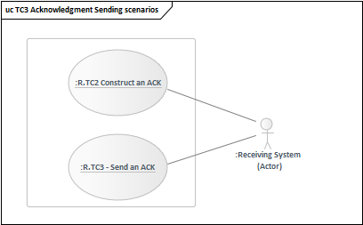

# Generelle tekniske use cases for afsendelse og modtagelse af meddelelser, kvitteringer og kuverter 

  

  

**Dokumenthistorik**

| Dato       | Initialer | Version | Ændring |
|------------|-----------|---------|---------|
| 2022-05-01 | OVI       | 1.0.0   |         |

**Indholdsfortegnelse**

[Indledning	3](#indledning)

> [Baggrund og formål](#baggrund-og-formål)
> [Målgruppe](#målgruppe)
> [Afgrænsning](#afgrænsning)
> [Referencer](#referencer)
> [Læsevejledning for use cases](#læsevejledning-for-use-cases)
> [Termer](#termer)
> [Illustration af et fagsystem og dets forretningsmæssige og tekniske dele](#illustration-af-et-fagsystem-og-dets-forretningsmæssige-og-tekniske-dele)

[Oversigt over use cases](#_Toc101994396)

> [Grafisk oversigt over use cases](#_Toc101994397)

[Use cases for afsendelse af meddelelser](#_Toc101994398)

> [S.TC1 Afsend meddelelse](#_Toc101994399)
> [S.TC2 Gensend automatisk meddelelse](#_Toc101994400)

[Use cases for modtagelse af meddelelser](#_Toc101994401)

> [R.TC1 Modtag meddelelse](#_Toc101994402)
>> [R.TC1.A1 Afvis meddelelse pga. invalidt teknisk indhold](#_Toc101994403)
>> [R.TC1.A2 Afvis meddelelse pga. teknisk fejl i modtagersystemet](#_Toc101994404)
> [R.TC3 Håndtér dubleret meddelelse](#_Toc101994405)

[Use cases for afsendelse af kvittering](#_Toc101994406)

> [R.TC2 Dan kvittering](#_Toc101994407)
> [R.TC3 Afsend kvittering](#_Toc101994408)

[Use cases for modtagelse af kvittering](#_Toc101994409)

> [S.TC3 Modtag kvittering (ACK AA)](#_Toc101994410)
>> [S.TC3.A1 Modtag negativ kvittering (ACK AR)](#_Toc101994411)
>> [S.TC3.A2 Modtag negativ kvittering (ACK AE)](#_Toc101994412)
> [S.TC4 Forventet kvittering ikke modtaget](#_Toc101994413)

[Regler for systemerne, som use casene beror på](#_Toc101994414)
> [Meddelelsesregler](#_Toc101994415)
> [Kvitteringsregler](#_Toc101994416)
> [Meddelelsestilstande](#_Toc101994417)
>> [Afsender](#afsender)
>> [Modtager](#modtager)

# Indledning 

Dette dokument indeholder en række tekniske use case til brug for implementering af alle MedComs meddelelsesstandarder.

Use case-beskrivelserne supplerer det øvrige dokumentationsmateriale og bør derfor læses i sammenhæng til dette (se afsnit 1.4).

## Baggrund og formål

Formålet med de tekniske use cases er at beskrive de generelle tekniske krav, der er forbundet med afsendelse og modtagelse af MedCom-standarder, herunder systemets funktionaliteter ift. kommunikationsnetværket samt afsendelse og modtagelse af kvitteringer. Dokumentet har til hensigt at sikre en ensartet implementering og anvendelse af MedCom-standarder.

## Målgruppe

Dokumentet målretter sig både it-systemleverandører og implementeringsansvarlige.

## Afgrænsning

Use casene i dette notat beskriver de tekniske handlinger, som ligger før og efter brugeraktørens interaktion med systemet (fx systemets funktionaliteter i kommunikationsnetværket samt afsendelse og modtagelse af kvitteringer). De handlinger/use cases, der vedrører brugeraktørens interaktion med systemet, og som beskriver de forretningsmæssige krav til standarden, optræder som selvstændigt beskrevne use cases i et dokument baseret på ”SKA-4.X.X Forretningsmæssige use cases”.

Tekniske afsender-use cases indledes således med, at systemaktøren henter meddelelsesindholdet fra [*fagsystemets forretningsmæssige udbakke*](#_Toc83807604) og afsluttes med, at systemaktøren sender meddelelsen ved at lægge den i [*Referencer*](#_Toc83807604). Ligeledes igangsættes tekniske modtager-use cases med, at systemaktøren modtager meddelelsen i [*fagsystemets tekniske indbakke*](#_Toc83807604) og afsluttes med, at systemaktøren lægger meddelelsen i [*fagsystemets forretningsmæssige indbakke*](#_Toc83807604). Se i øvrigt forklaring og illustration i afsnit 0.

## Referencer

| **Materiale/reference**                | **Version** | **Link/reference** | **Beskrivelse**                                            |
|----------------------------------------|-------------|--------------------|------------------------------------------------------------|
| SKA-4.X.X Forretningsmæssige use cases | SKA-4.XX    | LINK               | Skabelon, som disse use cases er udarbejdet på baggrund af |

## Læsevejledning for use cases

Use casene beskriver et detaljeret forløb over *systemaktørens* tekniske handlinger, som finder sted før og efter brugeraktørens interaktion med systemet.

Der skelnes mellem tre forskellige typer af use cases:

-   **Primære** tekniske use cases: For hvert teknisk scenarie vil der være beskrevet én primær teknisk use case, som beskriver normalforløbet over systemaktørens interaktion med kommunikationsnetværket.
-   **Alternative** tekniske use cases: Såfremt der kan være afvigelser til det tekniske normalforløb, vil der i den primære tekniske use case være henvist til alternative (selvstændigt beskrevne) tekniske use cases.
-   **Korrigerende tekniske** use cases: Ligeledes vil der ved korrigerende handlinger til forløbet (typisk rettelser og annulleringer) være henvist til korrigerende (selvstændigt beskrevne) use cases fra den primære use case. De korrigerende use cases vil typisk være generiske på tværs af forskellige use cases.

Alle use cases er opdelt i:

-   Afsender (S)-use case: Beskriver use casen fra systemets afsenderside (S = sender)
-   Modtager (R)-use case: Beskriver use casen fra systemets modtagerside (R = receiver)

Hver teknisk use case er bygget op af nedenstående elementer[^1].

[^1]: Use casene er udarbejdet med inspiration fra [KOMBIT’s metodehåndbog for use cases](https://www.kombit.dk/metodeh%C3%A5ndb%C3%B8ger)

| **Element**                         | **Forklaring**                                                                                                                                                                                                |
|-------------------------------------|---------------------------------------------------------------------------------------------------------------------------------------------------------------------------------------------------------------|
| ID                                  | Unikt ID                                                                                                                                                                                                      |
| Navn                                | Aktivitet i bydemåde                                                                                                                                                                                          |
| Igangsættende aktør\*               | I de tekniske use cases altid ’systemaktør’                                                                                                                                                                   |
| Formål\*                            | Kort beskrivelse af det tekniske formål, samt eventuel afgrænsning til andre use cases.                                                                                                                       |
| Startbetingelser/forudsætninger\*   | De forudsætninger, der skal være opfyldt for at scenariet/use casen kan gennemføres frem til slutresultatet.                                                                                                  |
| Igangsættende hændelse\*            | Den begivenhed eller hændelse, som udløser aktørens handlinger i scenariet/use casen.                                                                                                                         |
| Handlinger                          | Forløbet af handlinger, der – uden afbrydelser – fører fra den igangsættende begivenhed til slutresultatet.                                                                                                   |
| Slutresultat                        | Det ønskede tekniske mål                                                                                                                                                                                      |
| Alternative handlinger (A)          | Beskrivelse af eventuelle alternative handlinger, der afviger fra handlingerne i normalforløbet (med reference/link til alternative use case(s).                                                              |
| Korrigerende handlinger (CANC/CORR) | Beskrivelse af korrigerende handlinger, der foretaget, når et forløb ender med en fejlsituation eller med genoptagelse (med reference/link til korrigerende use cases. Eksempelvis rettelser og annulleringer |

Tabel 1: Oversigt over de elementer, som indgår i de tekniske use cases

## Termer

| **Termer**                               | **Beskrivelse**                                                                                                                                                                                                                                                                                                                                                                                                                                                                                        |
|------------------------------------------|--------------------------------------------------------------------------------------------------------------------------------------------------------------------------------------------------------------------------------------------------------------------------------------------------------------------------------------------------------------------------------------------------------------------------------------------------------------------------------------------------------|
| Fagsystem                                | Et fagsystem består – ift. meddelelsesforsendelse og -modtagelse – af en forretningsmæssig og en teknisk del. Fagsystemets to dele kan være alt fra et tæt sammenbygget system til to forskellige moduler i samme system, eller to systemer, der er konfigureret til at kommunikere sammen. Dette er uden betydning for use casenes opbygning.                                                                                                                                                         |
| Afsendersystem                           | Fagsystem hos afsender af en meddelelse                                                                                                                                                                                                                                                                                                                                                                                                                                                                |
| Modtagersystem                           | Fagsystem hos modtager af en meddelelse                                                                                                                                                                                                                                                                                                                                                                                                                                                                |
| Fagsystemets forretningsmæssige del      | I den forretningsmæssige del håndteres alt det faglige, som er fagsystemets primære anvendelsesområde.  Fagsystemets forretningsmæssige del består af Fagsystemets forretningsmæssige indbakke Fagsystemets forretningsmæssige modul  Fagsystemets forretningsmæssige udbakke                                                                                                                                                                                                                          |
| Fagsystemets tekniske del                | I den tekniske del håndteres kommunikationen med kommunikationsnetværket vedrørende afsendelse og modtagelse af meddelelser og kvitteringer. Her evalueres også hvilken kvitteringstype, der skal retur til afsender af en modtaget meddelelse. Fagsystemets tekniske del består af: Fagsystemets tekniske indbakke Fagsystemets tekniske meddelelsesmodul  Fagsystemets tekniske udbakke                                                                                                              |
| Fagsystemets forretningsmæssige modul    | I Fagsystemets forretningsmæssige modul håndteres alt det faglige, som er fagsystemets primære anvendelsesområde. Det er bl.a. her slutbrugeren arbejder med brugergrænsefladen i fagsystemet.                                                                                                                                                                                                                                                                                                         |
| Fagsystemets forretningsmæssige indbakke | Fagsystemets forretningsmæssige indbakke er en abstrakt term for den indgående funktionalitet mellem fagsystemets tekniske del og dets forretningsmæssige del i indgående retning set ift. den forretningsmæssige del.                                                                                                                                                                                                                                                                                 |
| Fagsystemets forretningsmæssige udbakke  | Fagsystemets forretningsmæssige udbakke er en abstrakt term for den udgående funktionalitet mellem fagsystemets forretningsmæssige del og dets tekniske del i udgående retning set ift. den forretningsmæssige del.                                                                                                                                                                                                                                                                                    |
| Fagsystemets tekniske meddelelsesmodul   | Fagsystemets tekniske meddelelsesmodul håndteres transformationer og valideringer af meddelelserne, og her evalueres også hvilken kvitteringstype, der skal retur til afsender af en modtaget meddelelse. Her håndteres også evt. konvolutindpakninger.                                                                                                                                                                                                                                                |
| Fagsystemets tekniske indbakke           | Fagsystemets tekniske indbakke er en abstrakt term for den indgående funktionalitet mellem kommunikationsnetværket og fagsystemets tekniske meddelelsesmodul i indgående retning set ift. kommunikationsnetværket. Fagsystemets tekniske indbakke er reelt kommunikationsnetværkets aflevering af en meddelelse til fagsystemet.                                                                                                                                                                       |
| Fagsystemets tekniske udbakke            | Fagsystemets tekniske udbakke er en abstrakt term for den udgående funktionalitet mellem fagsystemets forretningsmæssige udbakke og kommunikationsnetværket i udgående retning set ift. fagsystemets forretningsmæssige del. Fagsystemets tekniske udbakke er reelt forsendelse af en meddelelse til kommunikationsnetværket.                                                                                                                                                                          |
| Standarddokumentationen                  | En samlet dokumentation bestående af  Forretningsmæssig dokumentation Forretningsmæssige og tekniske use cases Profilering af standarden                                                                                                                                                                                                                                                                                                                                                               |
| Kommunikationsnetværket                  | Kommunikationsnetværket er det netværk, som meddelelser fysisk afsendes på. Netværket er pt det samme som VANS-netværket.                                                                                                                                                                                                                                                                                                                                                                              |
| Forsendelsesflow                         | Et Forsendelsesflow består af  Et meddelelsesflow fra afsenders Fagsystemets forretningsmæssige modul til modtagers Fagsystemets forretningsmæssige modul Et kvitteringsflow fra modtagersystemets Fagsystemets forretningsmæssige modul til det oprindelige afsendersystems Fagsystemets forretningsmæssige modul Ikke alle meddelelser og kvitteringer ses nødvendigvis af Fagsystemets forretningsmæssige slutbrugere, men deres indhold er tilgængeligt for Fagsystemets forretningsmæssige modul. |
| MeddelelsesId                            | Meddelelsens unikke Id, som danner baggrund for vurdering af, om en meddelelse tidligere er afsendt/modtaget                                                                                                                                                                                                                                                                                                                                                                                           |
| KuvertId                                 | Forsendelsens unikke Id, som danner baggrund for vurdering af, om en kuvert tidligere er modtaget                                                                                                                                                                                                                                                                                                                                                                                                      |
| ACK AA                                   | HL7 kvitteringsterm for en positiv kvittering. ACK AA er HL7s pendant til MedComs Positive CTRL ((X)CTL03)                                                                                                                                                                                                                                                                                                                                                                                             |
| ACK AE                                   | HL7 kvitteringsterm for en negativ kvittering, hvor modtagersystemet har haft en teknisk fejl under modtagelse af meddelelsen således, at den ikke kunne indlæses i systemet. HL7s ACK AE er ikke dækket af MedComs Negative CTRL ((X)CTL02)                                                                                                                                                                                                                                                           |
| ACK AR                                   | HL7 kvitteringsterm for en negativ kvittering på en meddelelse, hvis indhold er invalidt ift. standardens profilering. ACK AR er HL7s pendant til MedComs Negative CTRL ((X)CTL02)                                                                                                                                                                                                                                                                                                                     |

## Illustration af et fagsystem og dets forretningsmæssige og tekniske dele

Illustrationen herunder angiver i detaljer et forsendelsesflow mellem to fagsystemer for en given meddelelse. Indeværende dokument omfatter den tekniske del (markeret med grøn) af forsendelsesflowet, mens dokumentet ”Forretningsmæssige use cases” omfatter den forretningsmæssige del (markeret med rød).

De tekniske use cases vedrører primært hhv. Fagsystemets Tekniske Meddelelsesmodul og Fagsystemets Tekniske Udbakke i Afsendersystemet og Fagsystemets Tekniske Indbakke og Fagsystemets Tekniske Meddelelsesmodul i Modtagersystemet. Fagsystemets tekniske dele har i afsendersystemet udveksling med Fagsystemets Forretningsmæssige Udbakke og i modtagersystemet med Fagsystemets Forretningsmæssige Indbakke.

# Oversigt over use cases 

I denne oversigt over use cases kan det synes mærkeligt, at kvitterings use cases ”vender omvendt” ift. afsendelse og modtagelses use cases for meddelelser. Dette skyldes at use casene skal ses i sammenhæng i et Forsendelsesflow, som indebærer afsendelse/modtagelse af en meddelelse og afsendelse/modtagelse af den tilhørende kvittering.

| **Teknisk hændelse**                                    | **Afsender (S)-use case**                              | **Modtager (R)-use case**                |
|---------------------------------------------------------|--------------------------------------------------------|------------------------------------------|
| Afsend meddelelse                                       | [**S.TC1**](#_Toc82614226)                             |                                          |
| Gensend automatisk meddelelse                           | [**S.TC2**](#_S.TC2_-_Automatisk)                      |                                          |
| Modtag meddelelse                                       |                                                        | [**R.TC1** ](#_R.TC1_Modtagelse_af)      |
| *Afvis meddelelse pga. invalidt indhold*                |                                                        | [**R.TC1.A1**](#_R.TC1.A1_Afvisning_af)  |
| *Afvis meddelelse pga. teknisk fejl I modtagersystemet* |                                                        | [**R.TC1.A2**](#_R.TC1.A2_Afvisning_af)  |
| *Håndtér dubleret meddelelse*                           |                                                        | [**R.TC1.A3**](#_R.TC1.A3_Modtagelse_af) |
| Dan kvittering                                          |                                                        | [**R.TC2**](#_R.TC2_Dan_kvittering)      |
| Afsend kvittering                                       |                                                        | [**R.TC3**](#_R.TC2_Afsendelse_af)       |
| Modtag kvittering (ACK AA)                              | [**S.TC3** ](#_S.TC2_Modtagelse_af)                    |                                          |
| *Modtag negativ kvittering (ACK AE)*                    | [**S.TC3.A1**](#_S.TC2.A1_Modtagelse_af)               |                                          |
| *Modtag negativ kvittering (ACK AR)*                    | [**S.TC3.A2**](#_S.TC2.A2_Modtagelse_af)               |                                          |
| Forventet kvittering ikke modtaget                      | [**S.TC4**](#BKM_D8323758_66B8_46FA_A405_D03A01013483) |                                          |

## Grafisk oversigt over use cases 

Figur 1 Grafisk oversigt over tekniske use cases (R = Receiver, S = Sender, TC = Technical (use) Case, ACK AA = Positiv kvittering, ACK AE = Negativ kvittering (teknisk fejl), ACK AR = Negativ kvittering (invalidt indhold),

Ovenstående grafiske oversigt viser det samlede sæt af use cases, som dette dokument beskriver. I de følgende afsnit er de brudt ned i relevante grupperinger og vises i de følgende kapitler partielt. Teksten er på engelsk, men der er korrelation mellem id’er som er anvendt i dette dokument og grafikkens id’er.

# Use cases for afsendelse af meddelelser

Indsæt forklarende tekst til afsendelses use cases

S.TC1 Send a message = S.TC1 Afsend meddelelse

S.TC2 Resend automatic a message = S.TC2 Gensend automatisk meddelelse

## S.TC1 Afsend meddelelse 

| **S.TC1**                       | **Afsend meddelelse**                                                                                                                                       |
|---------------------------------|-------------------------------------------------------------------------------------------------------------------------------------------------------------|
| Igangsættende aktør             | Systemaktør                                                                                                                                                 |
| Formål                          | At Systemaktør afsender en meddelelse, som er blevet placeret i Fagsystemets forretningsmæssige udbakke                                                     |
| Startbetingelser/forudsætninger | Brugeraktør har afsendt en meddelelse                                                                                                                       |
| Igangsættende hændelse          | Systemaktør har lagt et meddelelsesindhold i Fagsystemets forretningsmæssige udbakke i meddelelsestilstand ”Sent” med henblik på afsendelse som meddelelse. |
| Handlinger                      | Systemaktør henter meddelelsesindholdet fra Fagsystemets forretningsmæssige udbakke                                                                         |
|                                 | Systemaktør formaterer meddelelsesindholdet iht. standardens meddelelsesformat                                                                              |
|                                 | Systemaktør markerer meddelelse for at ville modtage kvittering jf.Regler for systemerne, som use casene beror på                                           |
|                                 | Systemaktør sender meddelelsen ved at lægge den i Fagsystemets tekniske udbakke                                                                             |
|                                 | Systemaktør sætter meddelelsestilstand til ”Awaiting ACK”                                                                                                   |
| Slutresultat                    | Systemaktør har lagt en formateret meddelelse i meddelelsestilstanden ”Awaiting ACK” markeret med ønske om kvittering i Fagsystemets tekniske udbakke       |
| Alternative handlinger          | Ikke relevant                                                                                                                                               |
| Bemærkninger                    | Meddelelsen sendes med indhold som beskrevet i standarddokumentationen                                                                                      |

## S.TC2 Gensend automatisk meddelelse

| **S.TC2**                       | **Gensend automatisk meddelelse**                                                                                                                                        |
|---------------------------------|--------------------------------------------------------------------------------------------------------------------------------------------------------------------------|
| Igangsættende aktør             | Systemaktør                                                                                                                                                              |
| Formål                          | At Systemaktør automatisk gensender en meddelelse, som er blevet placeret i Fagsystemets forretningsmæssige udbakke                                                      |
| Startbetingelser/forudsætninger | Systemaktør har enten  Ikke modtaget kvittering på en meddelelse  eller  Modtaget negativ kvittering af typen ACK AE på en meddelelse                                    |
| Igangsættende hændelse          | Systemaktør har lagt et meddelelsesindhold i Fagsystemets forretningsmæssige udbakke i meddelelsestilstand ”Sent” med henblik på automatisk gensendelse af meddelelsen.  |
| Handlinger                      | Systemaktør henter meddelelsesindholdet fra Fagsystemets forretningsmæssige udbakke                                                                                      |
|                                 | Systemaktør formaterer meddelelsesindholdet iht standardens meddelelsesformat                                                                                            |
|                                 | Systemaktør markerer meddelelse for at ville modtage kvittering jf.Regler for systemerne, som use casene beror på                                                        |
|                                 | Pba. MeddelelsesId genkender Systemaktør meddelelsen som en tidligere afsendt meddelelse og tildeler herved meddelelsen en ny KuvertId.                                  |
|                                 | Systemaktør sender meddelelsen ved at lægge den i Fagsystemets tekniske udbakke                                                                                          |
|                                 | Systemaktør sætter meddelelsestilstand til ”Awaiting ACK”                                                                                                                |
| Slutresultat                    | Systemaktør har lagt en formateret meddelelse markeret med ønske om kvittering i Fagsystemets tekniske udbakke. Meddelelsestilstand til ”Awaiting ACK”                   |
| Alternative handlinger          | Ikke relevant                                                                                                                                                            |
| Bemærkninger                    | Meddelelsen sendes med indhold som beskrevet i standarddokumentationen                                                                                                   |

# Use cases for modtagelse af meddelelser

Indsæt forklarende tekst til modtagelses use cases

R.TC1 Receive a message (AE) = R.TC1 Modtag meddelelse

R.TC1.A1 Reject a message (AE) = R.TC1.A1 Afvis meddelelse pga. invalidt teknisk indhold

R.TC1.A1 Reject a message (AR) = R.TC1.A2 Afvis meddelelse pga. teknisk fejl i modtagersystemet

## R.TC1 Modtag meddelelse

| **R.TC1**                       | **Modtag meddelelse**                                                                                                                                                                                           |
|---------------------------------|-----------------------------------------------------------------------------------------------------------------------------------------------------------------------------------------------------------------|
| Igangsættende aktør             | Systemaktør                                                                                                                                                                                                     |
| Formål                          | At lægge en meddelelse i Fagsystemets forretningsmæssige indbakke med henblik på forretningsmæssig modtagelse af meddelelsen                                                                                    |
| Startbetingelser/forudsætninger | Kommunikationsnetværket har lagt en meddelelse i Fagsystemets tekniske indbakke                                                                                                                                 |
| Igangsættende hændelse          | Systemaktør registrerer, at der er modtaget en meddelelse i Fagsystemets tekniske indbakke                                                                                                                      |
| Handlinger                      | Systemaktør henter meddelelse i Fagsystemets tekniske indbakke og logger tilstrækkelige metadata i systemet, så der kan afsendes en kvittering.                                                                 |
|                                 | Systemaktør evaluerer meddelelsen positivt (ACK AA) mod standardens profilering og sætter meddelelsen i                                                                                                         |
|                                 | Systemaktør konstaterer, at meddelelsen er markeret for at ville modtage kvittering jf. Regler for systemerne, som use casene beror på og logger/markerer, at der skal sendes positiv kvittering                |
|                                 | Systemaktør sætter meddelelsestilstand til ”Validated”                                                                                                                                                          |
|                                 | Systemaktør formaterer meddelelsesindholdet iht. fagsystemets meddelelsesformat                                                                                                                                 |
|                                 | Systemaktør lægger meddelelsesindholdet i Fagsystemets forretningsmæssige indbakke                                                                                                                              |
| Slutresultat                    | Systemaktør har lagt et formateret meddelelsesindholdet i Fagsystemets forretningsmæssige indbakke og logget/markeret for, at der skal sendes en positiv kvittering. Meddelelsestilstand er sat til ”Validated” |
| Alternative handlinger          | 2a. R.TC1.A1 Afvis meddelelse pga. invalidt teknisk indhold 2b. R.TC1.A2 Afvis meddelelse pga. teknisk fejl i modtagersystemet                                                                                  |
| Bemærkninger                    | Meddelelsen modtages med indhold som beskrevet i standarddokumentationen for den pågældende meddelelse                                                                                                          |

### R.TC1.A1 Afvis meddelelse pga. invalidt teknisk indhold

| **R.TC1.A1**                                                   | **Afvis meddelelse pga. invalidt teknisk indhold.**                                                                                                                                                        |
|----------------------------------------------------------------|------------------------------------------------------------------------------------------------------------------------------------------------------------------------------------------------------------|
| Reference til use case som denne use case er et alternativ til | [R.TC1 Modtag meddelelse](#_R.TC1_Modtagelse_af)                                                                                                                                                           |
| Handlinger                                                     | Systemaktør henter meddelelsen i Fagsystemets tekniske indbakke og logger tilstrækkelige metadata i systemet, så der kan afsendes en kvittering.                                                           |
|                                                                | Systemaktør evaluerer meddelelsen negativt (ACK AR) mod standardens profilering                                                                                                                            |
|                                                                | Systemaktør logger/markerer, at der skal sendes negativ kvittering pba. invalidt teknisk indhold.                                                                                                          |
|                                                                | Systemaktør sætter meddelelsestilstand til ”In-error”                                                                                                                                                      |
| Slutresultat                                                   | Systemaktør har afvist en meddelelse modtaget i Fagsystemets tekniske indbakke og logget/markeret for, at der skal sendes en negativ kvittering af typen ACK AR. Meddelelsestilstand er sat til ”In-error” |
| Bemærkninger                                                   |                                                                                                                                                                                                            |

### R.TC1.A2 Afvis meddelelse pga. teknisk fejl i modtagersystemet

| **R.TC1.A2**                                                   | **Afvis meddelelse pga. teknisk fejl i modtagersystemet**                                                                                                                                                      |
|----------------------------------------------------------------|----------------------------------------------------------------------------------------------------------------------------------------------------------------------------------------------------------------|
| Reference til use case som denne use case er et alternativ til | [R.TC1 Modtag meddelelse](#_R.TC1_Modtagelse_af)                                                                                                                                                               |
| Handlinger                                                     | Systemaktør henter meddelelsen i Fagsystemets tekniske indbakke og logger tilstrækkelige metadata i systemet, så der kan afsendes en kvittering.                                                               |
|                                                                | Systemaktør forsøger at evaluere og persistere meddelelsen, men konstaterer, at meddelelsen hverken kan evalueres og/eller persisteres pga. en teknisk fejl ifm. modtagersystemets modtagelse af meddelelsen.  |
|                                                                | Systemaktør evaluerer derfor meddelelsen negativt (ACK AE) og Systemaktør logger/markerer, at der skal sendes negativ kvittering pba. teknisk fejl i modtagersystemet.                                         |
|                                                                | Systemaktør sætter meddelelsestilstand til ”In-error”                                                                                                                                                          |
| Slutresultat                                                   | Systemaktør har afvist en meddelelse modtaget i Fagsystemets tekniske indbakke og logget/markeret for, at der skal sendes en negativ kvittering af typen ACK AE. Meddelelsestilstand er sat til ”In-error”     |
| Bemærkninger                                                   |                                                                                                                                                                                                                |

## R.TC3 Håndtér dubleret meddelelse 

| **R.TC3**                       | **Håndtér af dubleret meddelelse**                                                                                                                                                                                                               |
|---------------------------------|--------------------------------------------------------------------------------------------------------------------------------------------------------------------------------------------------------------------------------------------------|
| Igangsættende aktør             | Systemaktør                                                                                                                                                                                                                                      |
| Formål                          | At håndtere at samme meddelelse modtages flere gange fra kommunikationsnetværket                                                                                                                                                                 |
| Startbetingelser/forudsætninger | Kommunikationsnetværket har lagt en meddelelse i Fagsystemets tekniske indbakke                                                                                                                                                                  |
| Igangsættende hændelse          | Systemaktør registrerer, at der er modtaget en meddelelse i Fagsystemets tekniske indbakke                                                                                                                                                       |
| Handlinger                      | Systemaktør henter meddelelse i Fagsystemets tekniske indbakke og persisterer den i systemet                                                                                                                                                     |
|                                 | Systemaktør evaluerer meddelelsen og dens metadatainformation og vurderer den som en dublet af en tidligere modtaget meddelelse.                                                                                                                 |
|                                 | Systemaktør konstaterer, at systemet skal sende kvittering af samme type og med samme indhold, som blev sendt som feedback på originalmeddelelsen jf.Regler for systemerne, som use casene beror på og logger/markerer, at en sådan skal sendes. |
|                                 | Systemaktør sætter meddelelsestilstand til ”Dublet”                                                                                                                                                                                              |
| Slutresultat                    | Systemaktør har markeret meddelelsens tilstand som ”Dublet” og logget/markeret, at systemet skal sende kvittering af samme type og med samme indhold, som blev sendt som feedback på originalmeddelelsen                                         |
| Alternative handlinger          | Ikke relevant                                                                                                                                                                                                                                    |
| Bemærkninger                    |                                                                                                                                                                                                                                                  |

# Use cases for afsendelse af kvittering

Indsæt forklarende tekst til afsendelse af kvitterings use cases

## R.TC2 Dan kvittering 

| **R.TC2**                       | **Dan kvittering**                                                                                                                                                 |
|---------------------------------|--------------------------------------------------------------------------------------------------------------------------------------------------------------------|
| Igangsættende aktør             | Systemaktør                                                                                                                                                        |
| Formål                          | At Systemaktør danner en korrekt udformet kvittering og lægger denne i Fagsystemets forretningsmæssige udbakke                                                     |
| Startbetingelser/forudsætninger | Systemaktør har registreret logningsinformation omkring kvittering for en given meddelelse                                                                         |
| Igangsættende hændelse          | Systemaktør konstater at der er logningsinformation omkring kvittering for en given meddelelse                                                                     |
| Handlinger                      | Systemaktør henter logningsinformation omkring kvittering                                                                                                          |
|                                 | Systemaktør opretter kvittering pba. logningsinformation og formaterer denne iht. kvitteringens meddelelsesformat                                                  |
|                                 | Systemaktør lægger kvitteringen i Fagsystemets forretningsmæssige udbakke                                                                                          |
|                                 | Systemaktør sætter meddelelsestilstand til ”Waiting to be send”                                                                                                    |
| Slutresultat                    | Systemaktør har dannet korrekt udformet kvittering ved at lægge den i Fagsystemets forretningsmæssige udbakke. Meddelelsestilstand er sat til ”Waiting to be send” |
| Alternative handlinger          | Ikke relevant                                                                                                                                                      |
| Bemærkninger                    | Kvitteringen dannes med indhold som beskrevet i kvitteringsstandarden                                                                                              |

## R.TC3 Afsend kvittering 

| **R.TC3**                       | **Afsend kvittering**                                                                                                         |
|---------------------------------|-------------------------------------------------------------------------------------------------------------------------------|
| Igangsættende aktør             | Systemaktør                                                                                                                   |
| Formål                          | At Systemaktør afsender en kvittering, som er blevet placeret i Fagsystemets forretningsmæssige udbakke                       |
| Startbetingelser/forudsætninger | Systemaktør har dannet kvitteringsindhold                                                                                     |
| Igangsættende hændelse          | Systemaktør har lagt et kvitteringsindhold i Fagsystemets forretningsmæssige udbakke med henblik på afsendelse som kvittering |
| Handlinger                      | Systemaktør henter kvitteringsindhold i Fagsystemets forretningsmæssige udbakke                                               |
|                                 | Systemaktør opretter kvittering pba. kvitteringsindhold og formaterer denne iht. standardens meddelelsesformat                |
|                                 | Systemaktør sender kvitteringen ved at lægge den i Fagsystemets tekniske udbakke                                              |
|                                 | Systemaktør sætter meddelelsestilstand til ”Acknowleged”                                                                      |
| Slutresultat                    | Systemaktør har lagt en formateret kvittering i Fagsystemets tekniske udbakke. Meddelelsestilstand er sat til ”Acknowleged”   |
| Alternative handlinger          | Ikke relevant                                                                                                                 |
| Bemærkninger                    | Kvitteringen sendes med indhold som beskrevet i kvitteringsstandarden                                                         |

# Use cases for modtagelse af kvittering

Indsæt forklarende tekst til modtagelse af kvitterings use cases

S.TC3 Receive an ACK (AA) = S.TC3 Modtag kvittering (ACK AA)

S.TC3.A1 Receive an ACK (AR) = S.TC3.A1 Modtag negativ kvittering (ACK AE)

S.TC3.A2 Receive an ACK (AE) = S.TC3.A2 Modtag negativ kvittering (ACK AE)

S.TC4 Do not receive an ACK = S.TC4 Forventet kvittering ikke modtaget

## S.TC3 Modtag kvittering (ACK AA)

| **S.TC3**                       | **Modtag kvittering (ACK AA)**                                                                                                                                                                          |
|---------------------------------|---------------------------------------------------------------------------------------------------------------------------------------------------------------------------------------------------------|
| Igangsættende aktør             | Systemaktør                                                                                                                                                                                             |
| Formål                          | At Systemaktør teknisk modtager en korrekt udformet kvittering og markerer den oprindelige afsendte meddelelse som sendt og kvitteret                                                                   |
| Startbetingelser/forudsætninger | Kommunikationsnetværket har lagt en kvitteringsmeddelelse i Fagsystemets tekniske indbakke                                                                                                              |
| Igangsættende hændelse          | Systemaktør registrerer, at der er modtaget en kvitteringsmeddelelse i Fagsystemets tekniske indbakke                                                                                                   |
| Handlinger                      | Systemaktør henter kvitteringsmeddelelse i Fagsystemets tekniske indbakke og persisterer den i systemet                                                                                                 |
|                                 | Systemaktør evaluerer kvitteringsmeddelelsen teknisk valid ved brug af Kvitteringsregler                                                                                                                |
|                                 | Systemaktør markerer den oprindelige meddelelse for at være sendt og positivt kvitteret ved at sætte meddelelsestilstand til ”Acknowleged”                                                              |
|                                 | Systemaktør udtrækker metadatainformation fra kvitteringen og lægger denne i Fagsystemets forretningsmæssige indbakke                                                                                   |
| Slutresultat                    | Systemaktør har markeret den oprindelige meddelelses tilstand til ”Acknowleged”, og har lagt metadatainformation om denne i Fagsystemets forretningsmæssige indbakke.                                   |
| Alternative handlinger          | Hvis handlingspunkt 2 ikke er positiv (ACK AA) kan en af følgende 2 handlinger være alternative handlinger: - S.TC3.A2 Modtag negativ kvittering (ACK AE) - S.TC3.A1 Modtag negativ kvittering (ACK AR) |
| Bemærkninger                    | Kvitteringen er modtaget med indhold som beskrevet i kvitteringsstandarden                                                                                                                              |

### S.TC3.A1 Modtag negativ kvittering (ACK AR)

| **S.TC3.A2**                                                   | **Modtag negativ kvittering (ACK AR) pga. invalidt indhold**                                                                                                  |
|----------------------------------------------------------------|---------------------------------------------------------------------------------------------------------------------------------------------------------------|
| Reference til use case som denne use case er et alternativ til | S.TC3 Modtag kvittering (ACK AA)                                                                                                                              |
| Handlinger                                                     | Systemaktør henter kvitteringsmeddelelse i Fagsystemets tekniske indbakke og persisterer den i systemet                                                       |
|                                                                | Systemaktør evaluerer kvitteringsmeddelelsen teknisk valid ved brug af Kvitteringsregler                                                                      |
|                                                                | Systemaktør konstaterer, at det er en negativ kvittering af typen ACK AR                                                                                      |
|                                                                | Systemaktør markerer den oprindelige meddelelse for at være permanent fejlet ved at sætte meddelelsestilstand til ”In-error”                                  |
|                                                                | Systemaktør udtrækker metadatainformation fra kvitteringen og lægger denne i Fagsystemets forretningsmæssige indbakke                                         |
| Slutresultat                                                   | Systemaktør har sat den oprindelige Meddelelses tilstand til ”In-error” og har lagt metadatainformation om dette i Fagsystemets forretningsmæssige indbakke.  |
| Bemærkninger                                                   | Kvitteringen er modtaget med indhold som beskrevet i kvitteringsstandarden                                                                                    |

### S.TC3.A2 Modtag negativ kvittering (ACK AE)

| **S.TC3.A1**                                                   | **Modtag negativ kvittering (ACK AE) pga. teknisk fejl under modtagelse i modtagersystem**                                                                                         |
|----------------------------------------------------------------|------------------------------------------------------------------------------------------------------------------------------------------------------------------------------------|
| Reference til use case som denne use case er et alternativ til | S.TC3 Modtag kvittering (ACK AA)                                                                                                                                                   |
| Handlinger                                                     | Systemaktør henter kvitteringsmeddelelse i Fagsystemets tekniske indbakke og persisterer den i systemet                                                                            |
|                                                                | Systemaktør evaluerer kvitteringsmeddelelsen teknisk valid ved brug af Kvitteringsregler                                                                                           |
|                                                                | Systemaktør konstaterer, at det er en negativ kvittering af typen ACK AE                                                                                                           |
|                                                                | Systemaktør markerer den oprindelige meddelelse til gensendelse ved at sætte meddelelsestilstand til ”Waiting for retry”                                                           |
| Slutresultat                                                   | Systemaktør har markeret den oprindelige meddelelse for at være fejlet og markeret den oprindelige meddelelse til gensendelse. Meddelelsestilstand er sat til ”Waiting for retry”. |
| Bemærkninger                                                   | Kvitteringen er modtaget med indhold som beskrevet i kvitteringsstandarden                                                                                                         |

## S.TC4 Forventet kvittering ikke modtaget

| **S.TC4**                       | **Forventet kvittering ikke modtaget**                                                                                                                                                   |
|---------------------------------|------------------------------------------------------------------------------------------------------------------------------------------------------------------------------------------|
| Igangsættende aktør             | Systemaktør                                                                                                                                                                              |
| Formål                          | At Systemaktør håndterer at en teknisk korrekt udformet kvittering ikke er modtaget                                                                                                      |
| Startbetingelser/forudsætninger | Kommunikationsnetværket har ikke lagt en kvitteringsmeddelelse i Fagsystemets tekniske indbakke og kvitteringens timer er udløbet                                                        |
| Igangsættende hændelse          | Systemaktør registrerer, at der ikke er modtaget en kvitteringsmeddelelse i Fagsystemets tekniske indbakke                                                                               |
| Handlinger                      | Systemaktør antager ved manglende modtagelse af kvittering, at den oprindelige meddelelse ikke er blevet modtaget.                                                                       |
|                                 | Systemaktør markerer den oprindelige meddelelse til gensendelse jf. kvitteringsregel KR7.S                                                                                               |
|                                 | Systemaktør sætter meddelelsestilstand til ”Waiting for retry”                                                                                                                           |
| Slutresultat                    | Systemaktør har markeret den oprindelige meddelelse for ikke at være modtaget og markeret den oprindelige meddelelse til gensendelse. Meddelelsestilstand er sat til ”Waiting for retry” |
| Alternative handlinger          | Ikke relevant                                                                                                                                                                            |
| Bemærkninger                    |                                                                                                                                                                                          |

# Regler for systemerne, som use casene beror på

## Meddelelsesregler

| **ID** | **Regel**                                                                                                                                                        |
|--------|------------------------------------------------------------------------------------------------------------------------------------------------------------------|
| MR1.S  | Der skal altid anmodes om kvittering på en FHIR-meddelelse                                                                                                       |
| MR2.S  | En meddelelse må forsøges gensendt 3 gange ved modtagelse af en ACK AE Kvittering                                                                                |
| MR3.S  | En meddelelse må forsøges gensendt 3 gange ved manglende modtagelse af en Kvittering                                                                             |
| MR5.R  | En meddelelse, der gensendes, skal altid opdateres med et nyt tidsstempel = Konvoluttid og en ny identifier = KonvolutId                                         |
| MR4.R  | En meddelelse består altid af en konvolut og et brev. Konvolutten indeholder altid en KonvolutId og KonvolutTid. Brevet indeholder altid et BrevId og en BrevTid |
| MR6.R  | En meddelelse er en dublet, hvis den indeholder samme MessageHeader.Id som en tidligere modtaget meddelelse                                                      |

## Kvitteringsregler

| **ID** | **Regel**                                                                                                                                                      |
|--------|----------------------------------------------------------------------------------------------------------------------------------------------------------------|
| KR1.R  | Der skal altid kvitteres på en FHIR-meddelelse                                                                                                                 |
| KR2.R  | Der må aldrig kvitteres på en kvitteringsmeddelelse                                                                                                            |
| KR3.R  | Hvis der ikke findes fejl under modtagelse af en meddelelse, kvitteres der positivt med ACK AA                                                                 |
| KR4.R  | Hvis en meddelelse validerer negativt mod standardens profilering, kvitteres der negativt med ACK AR                                                           |
| KR5.R  | Hvis der sker en teknisk fejl i modtagersystemet under modtagelse af en meddelelse, kvitteres der negativt med ACK AE                                          |
| KR6.R  | Hvis en modtaget meddelelse evalueres til at være en dublet, skal der altid svares med samme kvitteringsindhold som ved modtagelse af den originale meddelelse |
| KR7.S  | Hvis en kvittering på en meddelelse ikke er modtaget inden 30 minutter, markeres den originale meddelelse til gensendelse.                                     |

## Meddelelsestilstande

### Afsender

| **Tilstand**      | **Beskrivelse**                                                             |
|-------------------|-----------------------------------------------------------------------------|
| Sent              | Meddelelsen markeret som sendt i afsendersystemets forretningsmæssige modul |
| Awaiting ack      | Meddelelsen markeret som sendt i afsendersystemets tekniske modul           |
| Acknowleged       | Meddelelsen markeret som kvitteret for af afsendersystemets tekniske modul  |
| In-error          | Meddelelsen markeret som fejlet af afsendersystemets tekniske modul         |
| Waiting for retry | Meddelelsen markeret til gensendelse af afsendersystemets tekniske modul    |

### Modtager 

| **Tilstand**       | **Beskrivelse**                                                                        |
|--------------------|----------------------------------------------------------------------------------------|
| Received           | Meddelelsen markeret som modtaget i modtagersystemets forretningsmæssige modul         |
| Validated          | Meddelelsen markeret som valideret positivt (AA) i modtagersystemets tekniske modul    |
| Waiting to be send | Kvittering for meddelelsen markeret som dannet i modtagersystemets tekniske modul      |
| Acknowleged        | Meddelelsen markeret som kvitteret for i modtagersystemets tekniske modul              |
| In-error           | Meddelelsen markeret som valideret negativt (AR/AE) i modtagersystemets tekniske modul |
| Dublet             | Meddelelsen markeret som en dublet i modtagersystemets tekniske modul                  |
