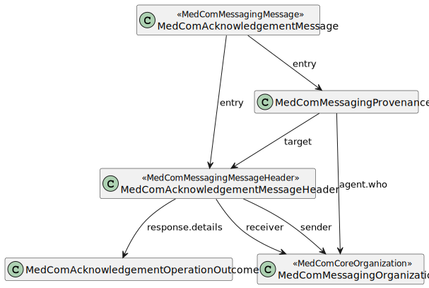

# Governance for MedCom Acknowledgement 

**Table of content**
* [1.MedComAcknowledgement message](#1-medcomacknowledgement-message)
    * [1.1 MedComAcknowledgement profile](#11-medcomacknowledgement-profile)
    * [1.2 MedComAcknowledgementMessageHeader](#12-medcomacknowledgementmessageheader)
        * [1.2.1 MedComAcknowledgementOperationOutcome](#121-medcomacknowledgementoperationoutcome)
    * [1.3 MedComAcknowledgementProvenance](#13-medcomacknowledgementprovenance)
    * [1.4 Envelope](#14-envelope)

## 1. MedComAcknowledgement message 
MedComAcknowledgement message follows the MedCom generic messaging model, except that the carbon-copy destination is not allowed. [Click here to read about the MedCom generic messaging model.](https://medcomdk.github.io/dk-medcom-messaging/assets/documents/Intro-Technical-Spec-ENG.html#21-medcommessagingmessage-bundle)  

The structure and included profiles in MedCom Acknowledgement can be seen on <a href="#fig1">Figure 1: 

<figure style="margin-left: 0px; margin-right: 0px; width: 100%;">

<figcaption text-align="left"><b>Figure 1: The structure and included profiles in MedCom Acknowledgement.</b></figcaption>
</figure>
 

### 1.1 MedComAcknowledgement profile 

<table class="tg" style="undefined;table-layout: fixed; width: 817px" id="Tab1">
<caption style="color:#2c415c;font-weight:bold"> Table 1: Overview of the Acknowledgement standard </caption>
<colgroup>
<col style="width: 145.88889px">
<col style="width: 670.88889px">
</colgroup>
<thead>
  <tr>
    <th class="tg-lc33">      Rule name  </th>
    <th class="tg-lc33">     Rules used to constrain the possibilities in a MedComAcknowledgementMessage </th>
  </tr>
</thead>
<tbody>
  <tr>
    <td class="tg-0pky">     MedCom-acknowledgement-1  </td>
    <td class="tg-0pky">    If the response.code is different than 'ok', a reference to an OperationOutcome resource shall be included. </td>
  </tr>
  <tr>
    <td class="tg-0pky">     MedCom-messaging- 3  </td>
    <td class="tg-0pky">    The message header shall conform to medcom-messaging-acknowledgementHeader profile </td>
  </tr>
  <tr>
    <td class="tg-0pky">     Medcom-messaging- 4 </td>
    <td class="tg-0pky">    The Acknowledgement entry shall contain at least two Provenance resource </td>
  </tr>
</tbody>
</table>

### 1.2 MedComAcknowledgementMessageHeader 

The message header SHALL conform to medcom-messaging-acknowledgementHeader profile.
Furthermore, when acknowledging a MedComMessage a response code indicating the type of Acknowledgement SHALL be included. 
[Click here to see the response codes](https://medcomfhir.dk/ig/acknowledgement/StructureDefinition-medcom-messaging-acknowledgementHeader.html#respons-code)

#### 1.2.1 MedComAcknowledgementOperationOutcome 

[MedComAcknowledgementOperationOutcome](https://medcomfhir.dk/ig/acknowledgement/StructureDefinition-medcom-acknowledgement-operationoutcome.html) SHALL be included in the bundle when the MessageHeader.response.code is different from ‘ok’. Further, an OperationOutcome resource may be included when the MessageHeader.response.code is ‘ok’, e.g. in cases where the received message is valid, but it is a dublet.When the MessageHeader.response.code is different form ‘ok’, OperationOutcome SHALL contain a description of the error and the severity of the error.
The ValueSet MedComAcknowledgementIssueDetailValues attached to the element OperationOutcome.response.detail.coding is used to describe the issue more detailed.
MedCom has developed a ValueSet with predefined issues descriptions that can help with troubleshooting. It is recommeded to use the ValueSet but it is also allowed to add self defined issue descriptions.  

[Click here to se MedCom defined issue descriptions](https://medcomfhir.dk/ig/terminology/ValueSet-medcom-acknowledgement-issue-details.html)

## 1.3 MedComAcknowledgementProvenance
When acknowledging a MedCom Message with an Acknowledgement, two Provenance instances SHALL be included; one describing the MedCom Message that is acknowledged and one describing the Acknowledgement. Therefore, an Acknowledgement Message will always contain two instances of Provenance resource.  

Furthermore, all instances of the Provenance resource SHALL comply to the [MedComMessagingProvenance profile](https://medcomfhir.dk/ig/messaging/StructureDefinition-medcom-messaging-provenance.html)  

## 1.4 Envelope
MedCom Acknowledgement message SHALL be wrapped in a VANSenvelope and sent over VANS-network. 
[To read more about the VANS-network click her.](https://medcomdk.github.io/MedCom-FHIR-Communication/assets/documents/030_Governance-for-Network-Layer.html)  

Values of fields used in a VANSenvelope SHALL obey to the specifications described on the page for VANSenvelope. [Click here to read the specifications for VANSenvelope.](https://medcomdk.github.io/MedCom-FHIR-Communication/assets/documents/FHIRMessages_NetworkEnvelopes_EN.html) 

