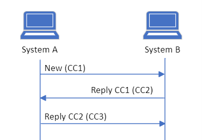
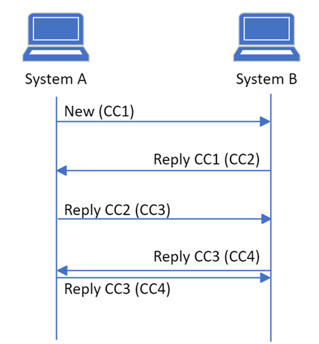
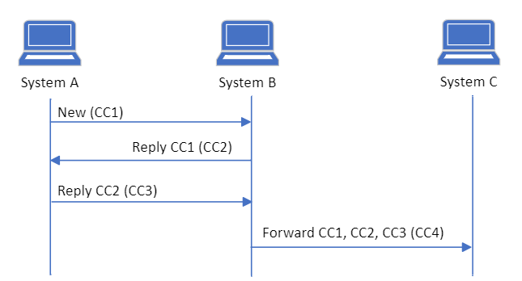

# Governance for MedCom CareCommunication

- [Coupling of messages](#coupling-of-messages)
- [Requirements and optionality regarding the flow](#requirements-and-optionality-regarding-the-flow)
   * [Rules regarding new CareCommunication ](#rules-regarding-new-carecommunication)
   * [Rules regarding replies ](#rules-regarding-replies)
   * [Rules regarding forwarding](#rules-regarding-forwarding)
   * [General rules ](#general-rules)
   * [Correction and cancellation](#correction-and-cancellation)
- [Acknowledgements](#acknowledgements)
- [Envelope ](#envelope)

A CareCommunication can be send as a new message from a sender to a receiver. When a new message is sent, a message thread is started. A message thread is the correspondence being displayed to the user. A new message can be replied to or forwarded. Depending on the type of response or actions from the user, a new message thread might be created. Governance concerning when to create a new message thread will be accounted for in the following.

Governance for CareCommunication must be seen as additional requirements besides the Implementation Guide, use cases and clinical guidelines for application. Consequently, the requirements for managing message threads are also included in the test protocols. 

# Coupling of messages

A communication identifier is implemented to ensure that CareCommunications sent back and forth between healthcare professionals are displayed correct and likewise to the sender and receiver. When to create a new communication identifier is presented in section Requirements and optionality regarding the flow.

A Provenance instance describes the activity of the current message, for example is it a new message or a reply. In case the message is a reply or forwarding, the instance will reference the MessageHeader.id from the message it is responding to. Further, the Provenance instance includes a reference to the payload(s) (also known as the message segments with text or attachments) in the Communication instance that are included for this current message. If there, for example, is included one payload with message text and two with attachments for the current message, the Provenance will include the identifier from all three payloads. 

# Requirements and optionality regarding the flow

## Rules regarding new CareCommunication 

**Sender system** 

|Rule name|Rules to contrain the use of new CareCommunications|
|:---|:---|
|medcom-carecommunication-1 | User of a sender system **SHALL** be able to send a new CareCommunication. The sender system **SHALL** include a unique communication identifier for the message thread. |

**Receiver system** 
|Rule name|Rules to contrain the use of new CareCommunications|
|:---|:---|
|medcom-carecommunication-2 | User of receiver systems **SHALL** be able to see a new CareCommunication is received in a new message thread. |

## Rules regarding replies 
It is a requirement that a system can send a reply to an already received CareCommunication, which can be a new message, reply or forwarding. It is also a requirement that a system can receive and display all message segments in the message to create a historical overview for the user. <a href="#Fig1">Figure 1</a> illustrates the flow for replying with CareCommunications.

<figure style="margin-left: 0px; margin-right: 0px; width: 100%;">

<figcaption text-align="left"><b>Figure 1 shows the communications flow when replying to a CareCommunication.</b></figcaption>
</figure>
 

**Sender system** 
|Rule name|Rules to contrain the use of reply CareCommunications|
|:---|:---|
|medcom-carecommunication-3 | User of a sender system **SHALL** be able to reply to a new CareCommunication or the latest received reply or forwarded CareCommunication. In these cases, the communication identifier **SHALL** remain the same in the reply. |
|medcom-carecommunication-4 | User of a sender system SHOULD be able to reply to the latest message when the latest message is sent from the sender system itself. |
|medcom-carecommunication-5 | User of the sender system **SHALL** NOT be able to reply to messages which isn't the latest. If this is necesary, a new message thread with a unique communication identifier **SHALL** be created. |
|medcom-carecommunication-6 | When replying to a CareCommunication that already includes an attachment, the base64-encoded content **SHALL** NOT be included, but the identifier, timestamp and title **SHALL** be included, and author information **SHALL** be included if available. |

**Receiver system**  

|Rule name|Rules to contrain the use of reply CareCommunications|
|:---|:---|
|medcom-carecommunication-7 | User of receiver system **SHALL** be able to see the received replies in the same message thread as previous CareCommunication with identical communication identifier.|
|medcom-carecommunication-8 | In cases where a CareCommunication does not arrive and an unknown message segment is afterwards included in a received CareCommunication, the unknown message segment **SHALL** be displayed to the user in the associated message thread. The messages **SHALL** be ordered by the timestamp from the message segment. It **SHALL** be clear to the user that an unread message is received.|
|medcom-carecommunication-9 | In cases where a CareCommunication arrives in unexpected order the received messages **SHALL** be displayed to the user in the associated message thread, ordered by the timestamp from the message segment. When a delayed CareCommunication appears, it **SHALL** be displayed in the same message thread. It **SHALL** be clear to the user that an unread message is received. |
|medcom-carecommunication-10 | In cases where a reply is received with an unknown communication identifier, the message segment(s) **SHALL** be displayed to the user in a new message thread.|
|medcom-carecommunication-11 | When two systems, at the same time, sends a reply to the same CareCommunication with the same communication identifier, both systems **SHALL** be able to handle receiving a reply which is not the latest reply in the message thread in the system. This is managed by including the received CareCommunication in the message thread with the same communication identifier. The flow for parallel sent CareCommunications is illustrated on <a href="#Fig2">Figure 2</a>. It **SHALL** be clear to the user that an unread message is received and which message it is a reply to. If the time stamps in the message segments are different, the messages **SHALL** be ordered by these and if they are identical the message segments **SHALL** be ordered by the sender of the messages. The message sent by the initiator of the communication **SHALL** appear as the first, followed by the message send by the replier.|
|medcom-carecommunication-12 | The user **SHALL** be able to continue the communication in the message thread after the flow of messages received in 8, 9, 10, and 11.|

> Note: For the scenarios (8, 9 and 10) the handling in the receiver system is the same: A) create a new message thread if the communication identifier is unknown or if known, include the message in the message thread with an identical communication identifier, B) order the messages based on the time stamp in the message segment, and C) make it clear to the user that an unread message is received.

<figure style="margin-left: 0px; margin-right: 0px; width: 100%;">

<figcaption text-align="left"><b>Figure 2 shows the communication flow when the user of system A and the user of system B in parallel replies to a sent CareCommunication.</b></figcaption>
</figure>
  

## Rules regarding forwarding

It is optional for the system to support forwarding of a CareCommunication; however, it is a requirement that all systems can receive and display a forwarded CareCommunication. If the sender system supports forwarding the user must be able to forward the entire message thread which may consist of one or more CareCommunications and attachments. System functionality where the user may choose and select which specified parts of the message thread that the user wishes to forward, is not required but optional. Only the chosen message segments and associated Provenances must be included. The flow of forwarded CareCommunications can be seen in <a href="#Fig3">Figure 3</a>.

<figure style="margin-left: 0px; margin-right: 0px; width: 100%;">

<figcaption text-align="left"><b>Figure 3 shows the communication flow when forwarding a CareCommunication where the user of system B chooses to forward the previous message thread to system C.</b></figcaption>
</figure>
 

**Sender system** 

|Rule name|Rules to contrain the use of forwarding CareCommunications|
|:---|:---|
|medcom-carecommunication-13 | User of sender system SHOULD be able to forward all CareCommunication in a message thread, as illustrated in <a href="#Fig3">Figure 3</a>. In this case, the forwarding **SHALL** include all previous message segments and the sender system **SHALL** create a new message thread with a new, unique communication identifier.|
|medcom-carecommunication-14 | User of sender system SHOULD be able to forward the latest sent or received CareCommunication or a previously sent or received CareCommunication. If the user forwards and choose specific parts of the message, only the selected CareCommunication **SHALL** be included. |
|medcom-carecommunication-15 | After forwarding a CareCommunication, the user **SHALL** be able to continue the communication in the original message thread.|

**Receiver system** 

|Rule name|Rules to contrain the use of forwarding CareCommunications|
|:---|:---|
|medcom-carecommunication-16 | Receiver system **SHALL** be able to display the forwarded CareCommunication in a new message thread. All content in the CareCommunication **SHALL** be displayed in the new message thread.|
|medcom-carecommunication-17 | The user **SHALL** be able to reply to a forwarded CareCommunication but **SHALL** NOT reply to one of the previous message segments included in the forwarding.|
|medcom-carecommunication-18 | If the system receives a forwarding, the user MAY forward this to a new receiver. In this case, the forwarding **SHALL** include all previous message segments and the sender system **SHALL** create a new message thread with a new, unique communication identifier.|

## General rules 

**Sender system** 

|Rule name|General rules to contrain the use of CareCommunications|
|:---|:---|
|medcom-carecommunication-19 | Sender system **SHALL** be able to receive and connect Acknowledgements to send CareCommunications and handle negative Acknowledgements.|
|medcom-carecommunication-20 | Sender system **SHALL** be able to handle communication identifier as stated above and add message segments and Provenance instances in a CareCommunication.|

**Receiver system** 

|Rule name|General rules to contrain the use of CareCommunications|
|:---|:---|
|medcom-carecommunication-21 | Receiver system **SHALL** be able to acknowledge a received CareCommunication with an Acknowledgement. The Acknowledgement **SHALL** include the latest Provenance from the CareCommunication and a new Provenance for the Acknowledgement.|
|medcom-carecommunication-22 | Receiver system **SHALL** display the messages in timely order based on the timestamp in the message segments.|
	

# Acknowledgements

|Rule name|General rules to contrain the use of Acknowledgement|
|:---|:---|
|medcom-carecommunication-23 | All MedCom FHIR messages **SHALL** be acknowledged. To acknowledge a CareCommunication message the [MedCom FHIR Acknowledgement](https://medcomdk.github.io/dk-medcom-acknowledgement/) standard **SHALL** be used.|

	
# Envelope 

|Rule name|Rules to contrain the use of VANSEnvelope|
|:---|:---|
|medcom-carecommunication-24 | Since the CareCommunication message is sent over the VANS-network, it **SHALL** be wrapped in a VANS-envelope. [This page describes the use of VANS-envelope](https://medcomdk.github.io/MedCom-FHIR-Communication/assets/documents/030_Governance-for-Network-Layer.html).|
|medcom-carecommunication-25 |Values of fields used in a VANSenvelope **SHALL** obey to the [specifications described on the page for VANSenvelope](https://medcomdk.github.io/MedCom-FHIR-Communication/assets/documents/FHIRMessages_NetworkEnvelopes_EN.html#31-carecommunication) for a CareCommunication message. |