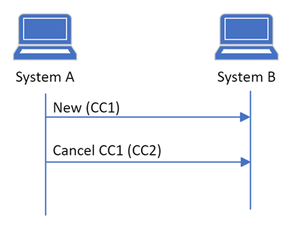
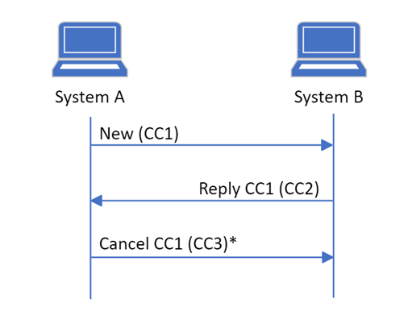
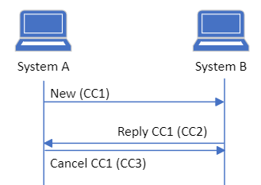
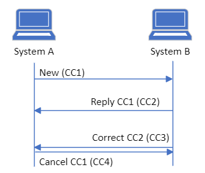

# Governance for MedCom CareCommunication

* [Exchang of CareCommunication messages](#exchang-of-carecommunication-messages)
   * [Rules and flows](#rules-and-flows)
      * [Rules regarding reply](#rules-regarding-reply)
      * [Rules regarding forwarding](#rules-regarding-forwarding)
      * [Rules regarding cancellation](#rules-regarding-cancellation)
         * [Cancellation ](#cancellation)
         * [Cancellation - rules regarding reply ](#cancellation-rules-regarding-reply)
         * [Cancellation - rules regarding forwarding ](#cancellation-rules-regarding-forwarding)
      * [Rules regarding correction](#rules-regarding-correction)
         * [Correction](#correction)
         * [Correction  - Rules regarding reply](#correction-rules-regarding-reply)
         * [Correction – Rules regarding forwarding ](#correction-rules-regarding-forwarding)
      * [Rules regarding parallel CareCommunications](#rules-regarding-parallel-carecommunications)
         * [Parallel reply and cancellation or correction ](#parallel-reply-and-cancellation-or-correction)
         * [Parallel cancellation and correction, including parallel cancellations and parallel corrections](#parallel-cancellation-and-correction-including-parallel-cancellations-and-parallel-corrections)
         * [Parallel replies](#parallel-replies)
   * [Acknowledgements](#acknowledgements)
   * [Envelope ](#envelope)

## Exchang of CareCommunication messages
Exchange of CareCommunications messages follows the regular message exchange over the VANS-network. The CareCommunication standard allows different activities, which is specified in the section Rules and flows.

### Rules and flows
Rules for managing flows regarding reply, forwarding, correction, cancellation and parallel CareCommunications have been defined and are described as part of governance for CareCommunication. 
The already defined requirements and recommendations, in the standard documentation, for sending and receiving CareCommunications in the form of reply, forwarding, correction and cancellation are still applicable and part of the test protocols. The rules defined here, for managing the mentioned flows, are also part of the test protocols with the purpose of ensuring conformity in the implementation. 

#### Rules regarding reply
It is a requirement that the system can send a reply to an already received CareCommunication. It is also a requirement that the system can receive and show a reply, including previous CareCommunications in the message thread as well as message segments and new attachments. 
* Both sender and receiver of a CareCommunication may reply to it.
* The user may reply to the latest sent or received CareCommunication or to a previously sent or received CareCommunication, as illustrated on <a href="#Fig1">Figure 1</a>.
* If the user replies to a previously sent or received CareCommunication only the previous CareCommunication, and the belonging message segments, must be included. Consequently, a new message thread, based on the new reply, must be created. On <a href="#Fig1">Figure 1</a>, the new message thread will include message CC1 and CC4.
* The previous message thread will still exist and communication in it is still possible. 

<figure style="margin-left: 0px; margin-right: 0px; width: 100%;">

<figcaption text-align="left"><b>Figure 1 shows the communications flow when replying to a CareCommunication. The lower reply of CC1 illustrates that the user of system B chooses to reply to a previously received CareCommunication and consequently a new message thread is created.</b></figcaption>
</figure>
 

#### Rules regarding forwarding
It is optional for the system to support forwarding of a CareCommunication, however it is a requirement that all systems can receive and show a forwarded CareCommunication. If the sender system supports forwarding the user must be able to forward the entire message thread which may consist of one or more CareCommunications and attachments, which is illustrated on <a href="#Fig2">Figure 2</a>, where message CC1, CC2, and CC3 are forwarded in CC4. The system functionality where the user may choose and select which specified parts of the message thread that the user wishes to forward, is not required but optional. 
* Both sender and receiver of a CareCommucation may forward it.
* The user may forward the latest sent or received CareCommunication or a previously sent or received CareCommunication.
* When a CareCommunication is forwarded, the sender of the forwarded CareCommunication is responsible for the content being forwarded as well as ensuring its relevance to the receiver. This both applies to attachments and message text. 
* When the entire message thread is forwarded, including previous CareCommunications and the belonging message segments and attachments, a new message thread with the new receiver must be created. 
* When a selected specified part of a CareCommunication is forwarded, only the selected CareCommunications and belonging message segments and attachments, must be forwarded. Consequently, a new message thread with the new receiver must be created. 
* After forwarding a CareCommunication, the communication in the original message thread may continue and it will not technically be possible to see, in the original message thread, that a CareCommuncation has been forwarded. 

<figure style="margin-left: 0px; margin-right: 0px; width: 100%;">

<figcaption text-align="left"><b>Figure 2 shows the communication flow when forwarding a CareCommunication where the user of system B chooses to forward the previous message thread to system C.</b></figcaption>
</figure>
 

#### Rules regarding cancellation
It is optional for systems to support sending cancellations, however it is a requirement that all systems can receive and show cancellations as well as display in the user interface that a CareCommunication has been cancelled. 

##### Cancellation 
A cancellation must be sent if a CareCommunication has been sent to an incorrect receiver, on a wrong personal identification number (cpr) or when a file with content on a wrong personal identification number (cpr) has been attached. When the system cancels a CareCommunication, the cancellation must both contain a reason for cancellation and a technical reference to the specific CareCommunication that is being cancelled. A simple illustration of a cancellation can be seen on <a href="#Fig3">Figure 3</a>. 
* A cancellation will at any time overrule any other CareCommunication status in a message thread (e.g. reply, forwarding and correction). If a cancellation is received the status of the entire message thread must be shown as ‘cancelled’. 
* The user can only cancel a CareCommunication that the sender system itself has sent. 

<figure style="margin-left: 0px; margin-right: 0px; width: 100%;">

<figcaption text-align="left"><b>Figure 3 shows the communication flow when the user of system A cancels a CareCommuncation sent from system A.</b></figcaption>
</figure>
 

* When a CareCommuncation is cancelled, in the middle of a message thread, as illustrated on <a href="#Fig4">Figure 4</a>, the cancellation must point to the specific CareCommunication that is being cancelled as well as the reason for cancellation. The cancelled message segment, as well as previous and following message segments, must be part of the cancellation. The status of the entire message thread must be ‘cancelled’. 

<figure style="margin-left: 0px; margin-right: 0px; width: 100%;">

<figcaption text-align="left"><b>Figure 4 shows the communication flow when the user of system A chooses to cancel a CareCommuncation that has already been replied. *CC2 will also be a part of the cancellation.</b></figcaption>
</figure>
 

* If the user still wishes to communicate after the cancellation, a new message thread must be created. 

##### Cancellation - rules regarding reply 
* The user must not reply to a received cancellation
* The user must not reply to a sent cancellation 
* The user may cancel a CareCommunication that has already been replied to. It is the responsibility of the receiver of the cancellation to act as required

##### Cancellation - rules regarding forwarding 
* The user must not forward a received cancellation 
* The user must not forward a sent canlcellation 
* The user may cancel a CareCommunication that has already been forwarded. It is the responsibility of the receiver of the cancellation to act as required. 

#### Rules regarding correction
It is optional for systems to support sending corrections, however it is a requirement that all systems can receive and show corrections as well as display in the user interface that a CareCommunication has been corrected.

##### Correction
A correction must be sent if the user has a correction to category, topic, message text, sender’s signature, the content in an attached file and/or author information in relation to the attached file, such as author’s name and time of creation. When the system corrects a CareCommunication, the correction must both contain the corrections and a technical reference to the specific CareCommunication that is being corrected. A simple illustration of a correction can be seen on <a href="#Fig5">Figure 5</a>.
* The user can only correct a CareCommunication that the sender system itself has sent. 

<figure style="margin-left: 0px; margin-right: 0px; width: 100%;">

<figcaption text-align="left"><b>Figure 5 shows the communication flow when the user of system A corrects a CareCommunication sent from system A.</b></figcaption>
</figure>
 

* When a CareCommunication is corrected, in the middle of a message thread, as illustrated on <a href="#Fig6">Figure 6</a>, the entire message thread including all message segments must be a part of the correction. The correction message itself must point to the specific message segment that is being corrected. 
* When sending and receiving a correction the status of the entire message thread must be ‘corrected’. 

<figure style="margin-left: 0px; margin-right: 0px; width: 100%;">

<figcaption text-align="left"><b>Figure 6 shows the communication flow when the user of system A corrects a CareComunication sent previously in the message thread. *CC2 and CC3 will also be a part of the correction.</b></figcaption>
</figure>
  

* The user must not correct a CareCommunication in a message thread that already has been cancelled.
* The user must not correct a CareCommunication in a message thread that has already been corrected.
* If the user still wishes to communication after the correction, a new message thread must be created. 

##### Correction  - Rules regarding reply
* The user must not reply to a received correction
* The user must not reply to a sent correction  
* The user may correct a CareCommunication that has already been replied to. It is the responsibility of the receiver of the correction to act as required.  

##### Correction – Rules regarding forwarding 
* The user must not forward a received correction 
* The user must not forward a sent correction 
* The user may correct a CareCommunication that has already been forwarded. It is the responsibility of the receiver of the correction to act as required. 

#### Rules regarding parallel CareCommunications
In the communication flow when exchanging CareCommunications situations may occur where CareCommunications, from sender’s and receivers’ system, are sent parallelly or where two CareCommuncations intersects each other due to e.g. delays in the systems or on the VANS network.  
The following scenarios has been identified:
* Parallel reply and cancellation or correction
* Parallel cancellation and correction, including parallel cancellations and parallel corrections
* Parallel replies 
The following paragraphs describes the rules for managing these scenarios if they occur. 

##### Parallel reply and cancellation or correction 
On <a href="#Fig7">Figure 7</a> is a simple illustration of the communication flow for parallel reply and cancellation or correction.

<figure style="margin-left: 0px; margin-right: 0px; width: 100%;">

<figcaption text-align="left"><b>Figure 7 shows the communication flow when the user of system A cancels/corrects a CareCommunication parallel to the user of system B sending a reply.</b></figcaption>
</figure>
  

* System A must handle receiving a reply parallel to the sent cancellation/correction. A is not responsible for acting upon the received reply. However, it is a requirement that system A displays in the user interface that an unread reply has been received.
* System B must handle receiving a cancellation/correction parallel to the sent reply. B is responsible for acting upon the received cancellation/correction in relation to the already sent reply. It is a requirement that system B displays in the user interface that an unread cancellation/correction has been received.  
* System A and B chooses themselves the display in the user interface in one or two message threads:
 *  Display the reply and cancellation or correction in one message thread with the status ‘cancelled/corrected’. 
 *  Display the reply and cancellation or correction in each their message threads with the status ‘cancelled/corrected’. It is important that both message threads have this status as a cancellation/correction has been sent or received. 
* If the user still wishes to communicate, a new message thread must be created. 

##### Parallel cancellation and correction, including parallel cancellations and parallel corrections
On <a href="#Fig8">Figure 8</a> is a simple illustration of the communication flow for parallel cancellation and correction.

<figure style="margin-left: 0px; margin-right: 0px; width: 100%;">

<figcaption text-align="left"><b>Figure 8 shows the communication flow when the user of system A cancels/corrects a CareCommunication parallel to the user of system B sending a cancellation/correction.</b></figcaption>
</figure>
  

* System A sends a cancellation/correction parallel to system B also sends a cancellation/correction.
* System A must handle receiving a cancellation/correction parallel to the sent cancellation/correction. It is a requirement that system A displays in the user interface that an unread cancellation/correction has been received. 
* System B must handle receiving a cancellation/correction parallel to the sent cancellation/correction. It is a requirement that system B displays in the user interface that an unread cancellation/correction has been received. 
* As previously mentioned, a cancellation will at any time overrule any other CareCommunication status in a message thread (e.g. reply, forwarding and correction).
* System A and B chooses themselves the display in the user interface in one or two message threads:
 *  Display parallel cancellations/corrections in one message thread with the status ‘cancelled’/’corrected’. 
 *  Display parallel cancellations/corrections in each their message threads with the status ‘cancelled’/’corrected’. It is important that both message threads have this status as a cancellation/correction has been sent or received. 
* If the user still wishes to communicate, a new message thread must be created. 

**Parallel cancellation and correction**:  
* It will always be the responsibility of the receiver of the cancellation to act as required when receiving a cancellation. 
* In cases where a cancellation and a correction are sent in parallel (intersects each other), it is the responsibility of the receiver of the cancellation to act as required.  

**Parallel cancellations**:  
* In cases where two cancellations are sent in parallel (intersects each other), it is the responsibility of both parties to act as required.  

**Parallel corrections**:  
* In cases where two corrections are sent in parallel (intersects each other), it is the responsibility of both parties to act as required.  

##### Parallel replies
On <a href="#Fig9">Figure 9</a> is a simple illustration of the communication flow for parallel replies.

<figure style="margin-left: 0px; margin-right: 0px; width: 100%;">

<figcaption text-align="left"><b>Figure 9 shows the communication flow when the user of system A and the user of system B in parallel replies to a sent CareCommunication</b></figcaption>
</figure>
  

* When two systems, at the same time, sends a reply to the same CareCommunication, both systems must handle receiving a reply that is not the latest reply in the message thread in one’s own system. This is managed by creating two message threads; one with the received reply and one with the sent reply. 
* It is recommended by MedCom that the users continue the communication in the message thread that contains the latest reply from the sender of the first CareCommunication in the message thread, here system A.  

### Acknowledgements
All MedCom FHIR messages **SHALL** be acknowledged. To acknowledge a CareCommunication message the [MedCom FHIR Acknowledgement](https://medcomdk.github.io/dk-medcom-acknowledgement/) standard **SHALL** be used.

### Envelope 
Since the CareCommunication message is sent over the VANS-network, it **SHALL** be wrapped in a VANS-envelope [This page describes the use of VANSenvelope](/docs/assets/documents/030_Governance-for-Network-Layer.md)

Values of fields used in a VANSenvelope **SHALL** obey to the [specifications described on the page for VANSenvelope](https://medcomdk.github.io/MedCom-FHIR-Communication/assets/documents/FHIRMessages_NetworkEnvelopes_EN.html#31-carecommunication) for a CareCommunication message.
