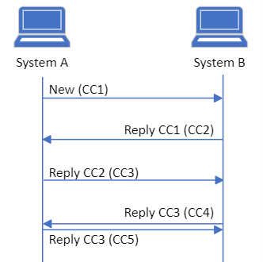

# Governance for MedCom CareCommunication

- [Coupling of messages](#coupling-of-messages)
- [Requirements and optionality regarding the flow](#requirements-and-optionality-regarding-the-flow)
   * [Rules regarding new CareCommunication ](#rules-regarding-new-carecommunication)
   * [Rules regarding replies ](#rules-regarding-replies)
   * [Rules regarding forwarding](#rules-regarding-forwarding)
   * [General rules ](#general-rules)
   * [Correction and cancellation](#correction-and-cancellation)
- [Acknowledgements](#acknowledgements)
- [Envelope ](#envelope)

A CareCommunication can be send as a new message from a sender to a receiver. When a new message is sent, a message thread is started. A message thread is understood as the messages and correspondence being displayed to the user. A new message can be replied to or forwarded. Depending on the type of response or actions from the user, a new message thread might be started. Governance concerning when to create a new message thread will be accounted for in the following.

Governance for CareCommunication must be seen as additional requirements besides the Implementation Guide, use cases and clinical guidelines for application. Consequently, the requirements for managing message threads will also be included in the test protocols. Exchange of CareCommunications messages follows the regular message exchange over the VANS-network.

# Coupling of messages

A communication identifier is implemented to ensure that CareCommunications sent back and forth between healthcare professionals are displayed correctly and similarly to the sender and receiver. When to create a new communication identifier is presented in section Requirements and optionality regarding the flow.

A Provenance instance describes the activity of the current message is it for example a new message or a reply. In case the message is a reply or forwarding, the instance will reference the MessageHeader.id it is responding to. Further, the Provenance instance includes a reference to the payloads in the Communication instance (message segments with text or attachments) that are included for this current message. If there for example is included one payload with message text and two with attachments for the current message, the Provenance will reference all three identifiers for the payloads. 

# Requirements and optionality regarding the flow

## Rules regarding new CareCommunication 

**Sender system** 
1.	User of a sender system MUST be able to send a new CareCommunication. The sender system MUST include a unique communication identifier for the message thread.

**Receiver system** 
2.	User of receiver systems MUST be able to see a new CareCommunication in an independent message thread.

## Rules regarding replies 
It is a requirement that a system can send a reply to an already received CareCommunication. It is also a requirement that a system can receive and show a reply, which includes previous text and attachments from message segments in the message. <a href="#Fig1">Figure 1</a> illustrates the flow for replying with CareCommunications.

<figure style="margin-left: 0px; margin-right: 0px; width: 100%;">

<figcaption text-align="left"><b>Figure 1 shows the communications flow when replying to a CareCommunication. The lower reply of CC1 illustrates that the user of system B chooses to reply to a previously received CareCommunication and consequently a new message thread is created.</b></figcaption>
</figure>
 

**Sender system** 
3.	User of a sender system MUST be able to reply to a new CareCommunication or the latest received reply or forwarded CareCommunication, as illustrated with message CC1, CC2 and CC3 in <a href="#Fig1">Figure 1</a>. In these cases, the communication identifier MUST remain the same. 
4.	User of a sender system SHOULD be able to reply to the latest message when the latest message is sent from the sender system itself. 
5. User of the sender system MUST NOT be able to reply to messages which isn't the latest. If this is necesary, a new message thread with a unique communication identifier must be created. 
6.	When replying to a CareCommunication that already includes an attachment, only the identifier MUST be included in the reply, not the base64-encoded content. 

**Receiver system** 
7.	User of receiver system MUST be able to see the received replies in the same message thread as previous CareCommunication with identical communication identifier.
8.	In cases where a CareCommunication does not arrive and an unknown message is afterwards included in a CareCommunication, the unknown message segment must be displayed to the user in the associated message thread, ordered by the timestamp from the message segment. It MUST be clear to the user that an unread message is received.
9.	In cases where a CareCommunication arrives in unexpected order the received messages MUST be displayed to the user in the associated message thread, ordered by the timestamp from the message segment. When a delayed CareCommunication appears, it MUST be displayed in the same message thread. It MUST be clear to the user that an unread message is received. 
10.	In cases where a CareCommunication is received with an unknown communication identifier, the message segments must be displayed to the user in a new message thread.
11.	When two systems, at the same time, sends a reply to the same CareCommunication with the same communication identifier, both systems MUST be able to handle receiving a reply which is not the latest reply in the message thread in the system. This is managed by including the received CareCommunication in the message thread with the same communication identifier. It MUST be clear to the user that an unread message is received. The flow for parallel sent CareCommunications is illustrated on <a href="#Fig2">Figure 2</a>.

<figure style="margin-left: 0px; margin-right: 0px; width: 100%;">

<figcaption text-align="left"><b>Figure 2 shows the communication flow when the user of system A and the user of system B in parallel replies to a sent CareCommunication.</b></figcaption>
</figure>
  

## Rules regarding forwarding

It is optional for the system to support forwarding of a CareCommunication; however, it is a requirement that all systems can receive and show a forwarded CareCommunication. If the sender system supports forwarding the user must be able to forward the entire message thread which may consist of one or more CareCommunications and attachments. The system functionality where the user may choose and select which specified parts of the message thread that the user wishes to forward, is not required but optional. A flow of forwarded CareCommunications can be seen in Figure 3.

<figure style="margin-left: 0px; margin-right: 0px; width: 100%;">

<figcaption text-align="left"><b>Figure 3 shows the communication flow when forwarding a CareCommunication where the user of system B chooses to forward the previous message thread to system C.</b></figcaption>
</figure>
 

**Sender system** 
12.	User of sender system SHOULD be able to forward all CareCommunication in a message thread, as illustrated in Figure 3. This forwarding MUST include all previous message segments. In this case the sender system MUST create a new message thread with a new communication identifier.
13.	User of sender system SHOULD be able to forward the latest sent or received CareCommunication or a previously sent or received CareCommunication. If the user forwards and choose and select specific parts of the message, only the selected CareCommunication MUST be included. 
14.	After forwarding a CareCommunication, the user MUST be able to continue the communication in the original message thread.

**Receiver system** 
15.	Receiver system MUST be able to display the forwarded CareCommunication in a new message thread. All content in the CareCommunication MUST be displayed in the new message thread.
16.	The user MUST be able to reply to a forwarded CareCommunication but MUST NOT reply to one of the previous message segments included in the forwarding.

## General rules 
**Sender system**
17.	Sender system MUST be able to receive and connect Acknowledgements to send CareCommunications and handle negative Acknowledgements.
18.	Sender system MUST be able to handle communication identifier as stated above and add message segments and Provenance instances in a CareCommunication.
**Receiver system**
19.	Receiver system MUST be able to acknowledge a received CareCommunication with an Acknowledgement. The Acknowledgement MUST include the latest Provenance from the CareCommunication and a new Provenance for the Acknowledgement.
20.	Receiver system MUST display the messages in timely order based on the timestamp in the message segments.

## Correction and cancellation
Corrections and cancellations are not a part of the CareCommunication standard. If the user finds a mistake in a sent or received message, he or she is responsible for acting upon this and inform the involved parties. 

# Acknowledgements
All MedCom FHIR messages **SHALL** be acknowledged. To acknowledge a CareCommunication message the [MedCom FHIR Acknowledgement](https://medcomdk.github.io/dk-medcom-acknowledgement/) standard **SHALL** be used.

# Envelope 
Since the CareCommunication message is sent over the VANS-network, it **SHALL** be wrapped in a VANS-envelope. [This page describes the use of VANS-envelope](https://medcomdk.github.io/MedCom-FHIR-Communication/assets/documents/030_Governance-for-Network-Layer.html).

Values of fields used in a VANSenvelope **SHALL** obey to the [specifications described on the page for VANSenvelope](https://medcomdk.github.io/MedCom-FHIR-Communication/assets/documents/FHIRMessages_NetworkEnvelopes_EN.html#31-carecommunication) for a CareCommunication message.
