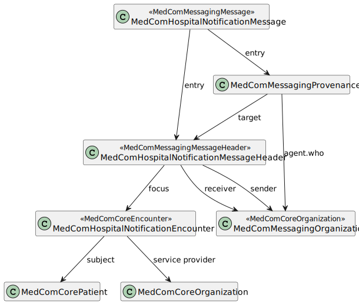

# Governance for MedCom HospitalNotification

* [1 Exchange of HospitalNotification message](#1-exchange-of-hospitalnotification-message)
  * [1.2 VANS-network and Fælleskommunal infrastructure](#12-vans-network-and-f-lleskommunal-infrastructure)
    * [Type A](#type-a)
    * [Type B](#type-b)
    * [Type C](#type-c)
  * [1.3 Acknowledgements](#13-acknowledgements)
  * [1.4 Envelopes](#14-envelopes)
* [2 HospitalNotification message](#2-hospitalnotification-message)
  * [2.1 MedComHospitalNotificationMessage profile](#21-medcomhospitalnotificationmessage-profile)
  * [2.2 MedComHospitalNotificationEncounter profile](#22-medcomhospitalnotificationencounter-profile)
  * [2.3 MedComMessagingProvenance](#23-medcommessagingprovenance)
  

## 1 Exchange of HospitalNotification message 

The flow of events of a HospitalNotification message differs from the regular message exchange over the VANS-network, as a message is exchange over the VANS-network and KOMBITs-network. Questions regarding KOMBITs infrastructure, called Fælleskommunal infrastructure, and KOMBIT's envelope, called Beskedfordeler-envelope, should be addressed to KOMBIT. 

### 1.2 VANS-network and Fælleskommunal infrastructure
The following sections describe the flow of a HospitalNotification message. There are three types of receiving systems that can receive a HospitalNotification: Type A, B and C. Since there is different requirements to acknowledging of a HospitalNotification, they are presented seperately.  

The flow of events and rules, when sending and receiving a HospitalNotification, are common for them all systems. However, a type C system shall not acknowledge a HospitalNotification.

|Rules describing the flow of events when sending, and acknowledging a HospitalNotification message|
|:---|
|A Sending EcoSystem **SHALL** wrap a HospitalNotification in a VANS-envelope|
|The Fælleskommunal infrastructure **SHALL** unwrap a HospitalNotification in a VANS-envelope|
|The Fælleskommunal infrastructure **SHALL** wrap a HospitalNotification in a Beskedfordeler-envelope|
|A Receiving EcoSystem **SHALL** unwrap a HospitalNotification in a Kombit beskedfordeler kuvert|
|A Receiving EcoSystem **SHALL** wrap an Acknowledgement in a Kombit beskedfordeler kuvert|
|The Fælleskommunal infrastructure **SHALL** unwrap a Acknowledgement in a Beskedfordeler-envelope|
|The Fælleskommunal infrastructure **SHALL** wrap a Acknowledgement in a VANS-envelope|
|A Sending EcoSystem **SHALL** unwrap an Acknowledgement in a VANS-envelope|

#### Type A
A Type A system is according to KOMBIT a receiving system that also shall receive and acknowledge a HospitalNotification. The acknowledgement of a Type A system is the basis for the Fælleskommunal infrastructure to sent an Acknowledgement to the sending system. 

(INSERT sequencediagram)

#### Type B
A Type B system is according to KOMBIT a receiving system that also shall receive and acknowledge a HospitalNotification. The acknowledgement of a Type B system isn't the basis for the Fælleskommunal infrastructur to sent an Acknowledgement to the sending system.

(INSERT sequencediagram)

#### Type C
A Type C system is according to KOMBIT a receiving system that is able to  receive a HospitalNotification, but not to acknowledge it.

(INSERT sequencediagram)

### 1.3 Acknowledgements

All MedCom FHIR messages **SHALL** be acknowledged, which is also valid for a HospitalNotification message. To acknowledge a HospitalNotification message the [MedCom FHIR Acknowledgement](https://medcomdk.github.io/dk-medcom-acknowledgement/) standard **SHALL** be used.

### 1.4 Envelopes

When the HospitalNotification message is sent over the VANS-network, it **SHALL** be in a VANS-envelope. [This page describes the use of VANS-envelope](/docs/assets/documents/030_Governance-for-Network-Layer.md)

Values of fields used in a VANSenvelope **SHALL** obey to the [specifications described on the page for VANSenvelope](https://medcomdk.github.io/MedCom-FHIR-Communication/assets/documents/FHIRMessages_NetworkEnvelopes_EN.html#32-hospitalnotification) for a HospitalNotification message.

When the HospitalNotification message is sent over KOMBITs-network, it **SHALL** be in a beskedfordelerkuvert. [More information can be found on](kombit.dk)

## 2 HospitalNotification message

HospitalNotification follows [MedComs generic messaging model](https://medcomdk.github.io/dk-medcom-messaging/assets/documents/Intro-Technical-Spec-ENG.html#21-medcommessagingmessage-bundle), which is described on the GitHub pages for the messaging IG. To embrace the business requiries, the HospitalNotification standard expands the generic messaging model by including more profiles and rules. The structure and included profiles can be seen on <a href="#Fig2">Figure 2</a>. The rules can be found below the figure. 

<figure style="margin-left: 0px; margin-right: 0px; width: 100%;">

<figcaption text-align="left"><b>Figure 2: The structure and included profiles in HospitalNotification</b></figcaption>
</figure>
 

### 2.1 MedComHospitalNotificationMessage profile

|Rule name|Rules used to constrain the possibilities in a MedComHospitalNotificationMessage profile|
|:---|:---|
|medcom-hospitalNotification-1 | The MessageHeader **SHALL** conform to MedComHospitalNotificationMessageHeader |
|medcom-hospitalNotification-2 | Entry **SHALL** contain exactly one patient resource |
|medcom-hospitalNotification-3 | All Provenance resources **SHALL** contain activities from medcom-hospitalNotification-messageActivities ValueSet |
|medcom-hospitalNotification-4 | The system of Patient.identifier **SHALL** be 'urn:oid:1.2.208.176.1.2', which represents an official Danish CPR-number |
|medcom-hospitalNotification-5 | The receiver of a HospitalNotification **SHALL** be a primary receiver. |
|medcom-messaging-2 | There **SHALL** be at least one Provenance resource in a MedCom message |
|medcom-messaging-3 | All Provenance resources shall conform to medcom-messaging-provenance profile |

 

### 2.2 MedComHospitalNotificationEncounter profile

One episodeOfCare-identifier **SHALL** be included. 

|Rule name|Rules used to constrain the possibilities in a MedComHospitalNotificationEncounter profile|
|:---|:---|
|uuidv5 | The episodeOfCare-identifier **MAY** be an LPR3-identifier, which **SHALL** be an UUID version 5. |
|medcom-hospitalNotification-6 | When the Encounter.status = onleave, the timestamp Encounter.extension:leavePeriod.start **SHALL** be present|

### 2.3 MedComMessagingProvenance

When sending an initial HospitalNotification exactly one instance of the Provenance resource **SHALL** be included. An initial HospitalNotification can be of the type STIN or STAA, as described in the [Clinical guidelines for application](https://medcomdk.github.io/dk-medcom-hospitalnotification/#11-clinical-guidelines-for-application). 

When sending a following HospitalNotification, both the previous instances describing the previous HospitalNotifications and a new instance describing the current HospitalNotification **SHALL** be included. 

> Note: The lateste Provenance can be identified be comparing Provenance.occurred in across all instances or by identify Provenance.target that is equal to MessageHeader.id in the current message.

When acknowlegding a HospitalNotification with an Acknowledgement, only the latest instance of the Provenance the HospitalNotification and the current instance of the Provenance describing the Acknowledgement **SHALL** be include. Therefore, will an Acknowledgement always include two instances of Provenance resources.

All instances of the Provenance resource **SHALL** comply to the [MedComMessagingProvenance profile](https://medcomfhir.dk/ig/messaging/StructureDefinition-medcom-messaging-provenance.html).

