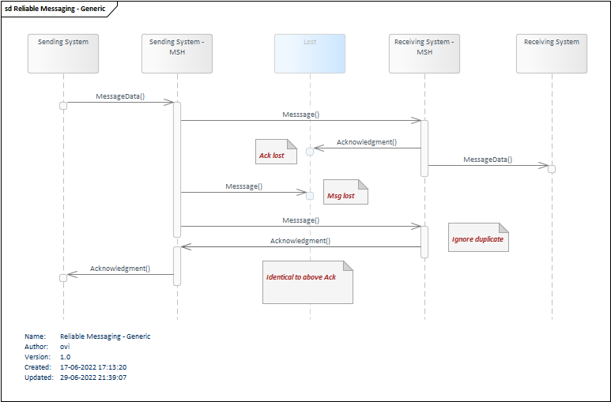

# Governance for MedCom FHIR®© Messaging

**Table of Content**

- [1. Introduction](#1-introduction-to-governance-for-medcom-fhir®©-messaging)
- [2. Governance for the Network Layer](#2-governance-for-network-layer)
  - [2.1 Asynchronous messaging](#21-asynchronous-messaging)
  - [2.2 Reliable Messaging](#22-reliable-messaging)
  - [2.3 Vansenvelope](#23-vansenvelope)
- [3. Governance for MedComFHIR Messaging](#3-governance-for-medcom-fhir-messaging)
  - [3.1 Basic Danish Messaging Assumptions](#31-basic-danish-messaging-assumptions-tbd)
  - [3.2 Message exchange patterns](#32-message-exchange-patterns)
  - [3.3 Reliable Messaging using MedCom FHIR Messaging](#33-reliable-messaging-using-medcom-fhir-messaging)
- [4. Governance for MedCom FHIR Messages](#4-governance-for-medcom-fhir-messages)
- [5. Governance for Test and Certification](#5-governance-for-test-and-certification)
- [6. Governance for Release Notes](#6-governance-for-release-notes)

---

[Governance Terms](/assets/documents/01-1-Governance_Terms.md)

## 1. Introduction to Governance for MedCom FHIR®© Messaging

On this page you can find information about how MedCom has profiled the [HL7 FHIR®© Messaging Framework](http://hl7.org/fhir/R4/messaging.html) to work in a Danish context.
Governance for MedCom HL7 FHIR®© Messaging describes the basic ruleset of how MedCom Messages shall be exchanged in the Danish Healthcare Messaging Network.
The Danish ruleset is based on both the ruleset for the Danish VANS Network, the Danish profiling of FHIR messaging and the general HL7 FHIR®© Communication Rules for FHIR Messaging.These “MedCom FHIR®© Messaging Governance rules” are intended to clarify the use of MedCom’s FHIR messages for the health and social area. Formerly these kind of rules for other MedCom Messaging paradigms were known as ”Syntax & Communication Rules”.

It is the intention that the “MedCom FHIR®© Messaging Governance rules” together with MedCom’s standards for the individual messages form the full and sufficient basis for implementing MedCom’s healthcare messages.The governance rules must thus be able to function as “chief judge”, where there is doubt about the practical application of MedCom’s FHIR messages.

The “Governance for MedCom FHIR®© Messaging” ensures a uniform use of MedCom’s FHIR messages to the health and social domains in Denmark.
In the following we follow a top-down approach by initially addressing shipping over the Network Layer and its ruleset, then the logistics for MedCom FHIR Messaging and lastly the basic ruleset of how to compose a MedCom FHIR message.

What you will find here is, how MedCom has profiled the HL7 FHIR®© Messaging Framework to work in a Danish context.

Governance for MedCom HL7 FHIR®© Messaging is the basic ruleset of how MedCom Messages must be exhanged in the Danish Healthcare Messaging Network.

The Danish ruleset is based on both the ruleset for the Danish VANS Network, the Danish profiling of FHIR messaging and the general HL7 FHIR®© Communication Rules for FHIR Messaging can be found on the [HL7 FHIR®© R4 Messaging Website](http://hl7.org/fhir/R4/messaging.html).

These "MedCom FHIR®© Messaging Governance rules" are intended to clarify the use of MedCom's FHIR messages for the health and social area. Formerly these kind of rules for other MedCom Messaging paradigms were known as 'Syntax & Communication Rules'

It is the intention that the governance rules together with MedCom's standards for the individual messages form the full and sufficient basis for implementing MedCom's healthcare messages.The governance rules must thus be able to function as “chief judge”, where there is doubt about the practical application of MedCom's FHIR messages.

The "Governance for MedCom FHIR®© Messaging" must ensure a uniform use of MedCom's FHIR messages to the health and social area domains in Denmark.

In the following we follow a top-down approach by addressing shipping over the Network Layer and its ruleset first, then the logistics for MedCom FHIR Messaging and last cover the basic ruleset of how to compose a MedCom FHIR message.

<!-- [Introduction details (Danish)](/assets/documents/01-Introduction.md)-->

<!-- [Generelle tekniske use cases](/assets/documents/Generelle-tekniske-use-cases-v1.0.0-b2.md) -->

## 2. Governance for Network Layer

The Danish Healthcare Messaging Network is currently the VANS Network on which the overall shipment of a message is handled through Asynchronous Messaging.

To be able to communicate over the VANS Network, both senders and receivers **SHALL** have an EAN number issued by the SOR.

To be able to communicate a specific MedCom FHIR messagetype both senders and receivers **SHALL** be registered in SOR with that messagetype and version.

The Sending system **SHALL** validate the message before dispatching it. Validating a message **SHALL** include validating the correct use of the ValueSets and Coding Systems used in the message.

## 2.1 Asynchronous Messaging

MedCom FHIR Messaging is based on Asynchronous Messaging.

In Asynchronous messaging, a Sending Ecosystem dispatches an unsolicited message to a Receiving Ecosystem possibly through several intermediate hubs, and besides from sending an possibly requested acknowledgement immediately as a response, the Receiving Ecosystem responds to the Sending System separately. The Receiving Ecosystem may respond more than once to any given message.

## 2.2 Reliable Messaging

MedCom FHIR Messaging uses Reliable Messaging.

A key part of the Messaging Network is to provide funcionality for Reliable Messaging.

Sending and Receiving Systems when acting in FHIR MEssaging scenarios **SHALL** support the Reliable Messaging scenarios outlined in the following section.

<figure style="margin-left: 0px; margin-right: 0px; width: 100%;">

<figcaption text-align="left"><b>Figure 1: Generic Reliable Messaging Model </b></figcaption>
</figure>
 

Realiable Messaging is the way to secure that important information sent through messaging is handled thoroughly and either is sent from the Sending Ecosystem, the Sending system and its MSH, to a Receiving Ecosystem, the Receiving System and its MSH, or is handled safely manually. In every part of a message chain something go wrong and Reliable Messaging is developed to handle that.

A message sent from the Sending Ecosystem to the intended Receiving Ecosystem can be well received but the returned acknowledgement can be lost. When discovering that the Sending Ecosystem after a well-agreed mutual time hasn't received the acknowledgement, it therefore has to resend the message. That message can be lost and again the Sending Ecosystem will not know whether that the message has been received or not. It will then have to resend the message again. This time it will be received and acknowledged as before and the acknowledgement will eventually reach the original Sending Ecosystem and the message transaction will be fulfilled. The Receiving Ecosystem will in the last event recognize the message as a duplicat and will return exactly the same acknowledgement content as the first time it received the message.
Any of these events can happen over time and therefore Reliable Messaging defines the ruleset used to govern these events.

## 2.2.1 Generic ruleset governing the principles of Reliable Messaging

|Generic ruleset governing the principles of Reliable Messaging|
|:---|
| A Sending Ecosystem **SHALL** send a Message with a flag indicating that it expects an Acknowledgement on the Message|
| A Receiving Ecosystem **SHALL** return an Acknowledgement on a received Message with a flag indicating that it expects a acknowledgement on the Message|
| A Sending Ecosystem **SHALL** be able to handle an unacknowledged Message|
| A Sending Ecosystem **SHALL** resend the Message, when the expected acknowledgement is not received within a timelimit of 15 minutes|
| A Sending Ecosystem **SHALL** change the MessageEnvelopeId and the MessageSentTime of a resend Message|
| A Sending Ecosystem **SHALL NOT** resend the Message more than 2 times, when the expected Acknowledgement is not received|
| A Receiving Ecosystem **SHALL** be able to receive a Message as a duplicate|
| A Receiving Ecosystem **SHALL NOT** present the end-user for a duplicate of a Message|
| A Receiving Ecosystem **SHALL** change the MessageEnvelopeId and the MessageSentTime of a resend Acknowledgement|
| A Receiving Ecosystem **SHALL** return the same Acknowledgement content on a received Message as it returned on the first received copy of the Message|

 

A specific ruleset for respectively the MedCom FHIR Message and the VANSEnvelope will be explained later in this Governance.

- [2.3.1 Reliable Messaging using VANSEnvelope](#231-reliable-messaging-using-vansenvelope)
- [3.3 Reliable Messaging using MedCom FHIR Messaging](#33-reliable-messaging-using-medcom-fhir-messaging)

### 2.2.2 Different Reliable Messaging scenarios

This section provides a description of the different types of Reliable Messaging scenarios in generic terms. For specific handling of these scenarios for VANSEnvelope and FHIR Messages see the description in the detailed sections of the respective chapters for these subjects.

The different types of Reliable Messaging scenarios are:

- Scenario #1 - Normally successful unsolicited message or request message flow with acknowledgement request
- Scenario #2 - Duplicate an unchanged message with a positive acknowledgement request
- Scenario #3 - (Re-)Sending Unchanged Message
- Scenario #4 - Message is sent normally, acknowledgement is lost along the way
- Scenario #5 - (Re-)Sending Modified Message

#### 2.2.2.1 Scenario #1 - Normally successful unsolicited message or request message flow with acknowledgement request (Google translated)

An unsolicited message or request message is sent with a new request for a positive acknowledgement from the Sending System to a Receiving System.
The Receiving System **SHALL** always send a positive acknowledgement to the Sending System.

#### 2.2.2.2 Scenario #2 - Duplicate an unchanged message with a positive acknowledgement request (Google translated)

Duplication of an unchanged message can be done in one of the following ways:

- An error may have occurred in the flow from the Sending System to the Receiving System with subsequent duplication of a message in scenario 1a.
- The Sending System may inadvertently send a duplicate of message

The messages are completely identical and as a consequence the message with request for positive acknowledgement arrives at the Receiving System more than once.

The Receiving System **SHALL** ignore the contents of the duplicate instances of the message, but **SHALL** acknowledge a duplicate message in the same way as the original message. A positive acknowledgement may not be sent first and then a negative acknowledgement or vice versa. The Receiving System **SHALL** never display several instances of a message in a message overview, but **SHALL** log in a system log that reception of a duplicate message has taken place. If the Sending System of the message has received acknowledgement already after the Receiving System's acknowledgement of a message's first instance, the Sending System **SHALL** similarly ignore the duplicate instances of the acknowledgement. The Sending System **SHALL** never display multiple instances of the same acknowledgement in a message summary, but **SHALL** log in a system log that acknowledgement of a duplicate has taken place.

#### 2.2.2.3 Scenario #3 - (Re) Sending Unchanged Message (Google translated)

Correct retransmission of a message.
The Sending System **SHALL** form a new envelope with a new ID and time of dispatch. Since there has been no change in the letter section, the rest of the message remains identical. The message is sent and acknowledged as a completely new message according to Scenario #1 or Scenario #2.
Re-dispatches are always done manually and should be in accordance with the normal response time for the specific message flow.

#### 2.2.2.4 Scenario #4 - Message is sent normally, acknowledgement is lost along the way (Google translated)

As Scenario #1, but where acknowledgement is lost along the way from the Sending System to the Receiving System.
The shipping pattern is like Scenario #3.

#### 2.2.2.5 Scenario #5 - (Re-) Sending Modified Message (Google translated)

If the content of the letter part is changed, the message is considered a completely new message with the consequent change of both EnvelopeId, LetterId and timestamp, where relevant.
Resubmissions are always done manually.

For historical reasons, there has been no requirement to use positive acknowledgements, which is why Scenario #1 can in practice be run as Scenario #2. The Sending System may therefore experience that there is no acknowledgement of a message, and it is not recommended to make program logic that sends messages.
For a number of standards, however, there is an explicit requirement for a positive acknowledgement, see the documentation for the individual standards if this is the case.

## 2.3 VANSEnvelope

The VANSenvelope is developed to contain xml-based or other non-edifact messagetypes over the VANS Network

MedCom FHIR Messages **SHALL** be enveloped in a VANSenvelope whether they are shipped as "application/fhir+xml" or "application/fhir+json"

- The enveloping of MedCom FHIR Messages **SHALL** follow the VANS ENVELOPE specification outlined in
  - [VANS ENVELOPE specification (Danish)](https://svn.medcom.dk/svn/releases/Standarder/Den%20gode%20VANSEnvelope/Dokumentation/Den%20gode%20VANSEnvelope.pdf)
- MedCom FHIR Messages **SHALL** follow the metadata specification outlined in
  - [Network Envelope (Danish)](/assets/documents/FHIRMessages_NetworkEnvelopes_DA.md)
  - [Network Envelope (English)](/assets/documents/FHIRMessages_NetworkEnvelopes_EN.md)

### 2.3.1 Reliable Messaging using VANSenvelope

VANSenvelope is developed to support Reliable Messaging.
VANSenvelope containing FHIR Messages **SHALL** make use of this Reliable Messaging functionality.

- The use of Reliable Messaging functionality when shipping MedCom FHIR Messages **SHALL** follow the VANS ENVELOPE specification outlined in
  - [VANS ENVELOPE specification (Danish)](https://svn.medcom.dk/svn/releases/Standarder/Den%20gode%20VANSEnvelope/Dokumentation/Den%20gode%20VANSEnvelope.pdf)

[Tap here to see how to setup Reliable Messaging using VANSEnvelope](/assets/documents/Reliable_Messaging-VANSEnvelope.md)

## 3. Governance for MedCom FHIR Messaging

This Governance for MedCom FHIR Messaging includes the corresponding OIOXML version of certain MedCom FHIR Messages, that are developed with the FHIR Message as the definer of the content of the OIOXML version.

FHIR Resources can be used in a traditional messaging context, much like HL7 v2.
<!-- Applications asserting conformance to this framework claim to be conformant to "FHIR messaging". -->

In FHIR messaging, a "request message" or an "unsolicited message" is sent from a source application (Sending System) to a destination application (Receiving System) when an event happens. Events mostly correspond to things that happen in the real world.

The message consists of a Bundle identified by the type "message", with the first resource in the Bundle being a MessageHeader resource. The MessageHeader resource has a code - the message event - that identifies the nature of the message, and it also carries additional metadata. The other resources in the Bundle depend on the type of the message, eg. in which context a message is triggered.

The events supported in MedCom FHIR Messaging, along with the resources that are included in them, are defined in: [MedCom FHIR Messaging events](/assets/documents/MedCom-FHIR-Messaging-Events.md).

The destination application processes the message and returns an acknowledgement message and maybe one or more response messages, which too are a Bundle of resources identified by the type "message", with the first resource in each Bundle being a MessageHeader resource with a response section that reports the outcome of processing the message and any additional response resources required.

## 3.1 Basic Danish Messaging Assumptions [TBD]

This specification assumes that content will be delivered from one application to another by some delivery mechanism, and then one or more responses will be returned to the source application.

In Denmark this specification rules the exchange of messages through the Danish Messaging Network, currently known as VANS, and using the central organization register, SOR, for delivering the virtual adressing information.

The agreements around the content of the messages and the behavior of the two applications form the "contract" that describes the exchange. These contracts are exactly what MedCom delivers in the Danish Healthcare Domain and therefore MedCom adds regional and local agreements to the rules defined in the HL7 FHIR®© specification.

This specification ignores the existence of interface engines and message transfer agents that exist between the source and destination. Either they are transparent to the message/transaction content and irrelevant to this specification, or they are actively involved in manipulating the message content (in particular, the source and destination headers are often changed). If these middleware agents are modifying the message content, then they become responsible for honoring the contract that applies (including applicable profiles) in both directions.

## 3.2 Message Exchange Patterns

Each MedCom FHIR message has one or more response messages. There **SHALL** be at least one response message, an acknowledgement message, so that the sender can know, that the message was properly received.

Multiple response messages **SHALL NOT** be returned for messages of consequence, and **SHOULD** not be returned for notifications.

In principle, source applications **SHOULD** not wait for a response to a transaction before issuing a new transaction. However, in many cases, the messages in a given stream are dependent on each other, and must be sent and processed in order. In addition, some transfer methods may require sequential delivery of messages.

## 3.3 Reliable Messaging using MedCom FHIR Messaging

FHIR Messaging is developed to support Reliable Messaging.
MedCom FHIR Messages **SHALL** make use of this Reliable Messaging functionality.

[Tap here to see how to set up Reliable Messaging using MedCom FHIR Messaging](/assets/documents/Reliable_Messaging-FHIR.md)

## 4. Governance for MedCom FHIR Messages

Below you see the basic MedCom FHIR Messaging Model.

As shown in the diagram below there are 4 MedCom profiled FHIR resources involved in a MedCom FHIR Message:

- A MedComMessagingMessage is a Bundle resource of type "message"
- The MedComMessagingMessage's first resource is a MedComMessagingMesssageHeader, which is a MesssageHeader resource
- The MedComMessagingMesssageHeader points to at least two organizations for the MedComMessagingMessage:
  - a source organization called a MedComMessagingOrganization, which is an Organization resource
  - a destination organization also a MedComMessagingOrganization, which too is an Organization resource
- The MedComMessagingMessage's MedComMessagingProvennance, which is a Provennance resource

 

## 4.1 MedComMessagingMessage (Bundle)

A Bundle resource of type "message", which is a container for a collection of other resources.

## 4.1.1 Scope and Usage

One common operation performed with resources is to gather a collection of resources into a single instance with containing context. In FHIR this is referred to as "bundling" the resources together. These resource bundles are useful for a variety of different reasons, including sending a set of resources as part of a message exchange (see Messaging)

[Bundle in FHIR R4](http://hl7.org/fhir/R4/Bundle.html)

## 4.1.2 MedComMessingMessage Rules

| MedComMessingMessage Rules|
|:---|
| A MedCom FHIR Message **SHALL** be a Bundle resource of type "message" |
| A MedCom FHIR Message **SHALL** contain at least one bundled MedComMessagingHeader resource |
| The MedComMessagingHeader resource **SHALL** be the first resource in a MedCom Message Bundle |
| A MedCom FHIR Message **SHALL** contain at least two bundled MedComMessagingOrganization resources |
| One of the two bundled MedComMessagingOrganization resources **SHALL** represent the Sender Organization pointed to by the MedComMessagingHeader.sender element |
| One of the two bundled MedComMessagingOrganization resources **SHALL** represent the Receiver Organization pointed to by the MedComMessagingHeader.destination:primary sliced element |
| A MedCom FHIR Message **MAY** contain more bundled MedComMessagingOrganization resources |
| The MedComMessagingHeader resource **MAY** include a list of carbon-copy receiver organizations pointed to by the MedComMessagingHeader.destination:cc sliced element(s) |
| The bundled MedComMessagingOrganization resource **MAY** represent one of the carbon-copy receiver Organizations pointed to by the MedComMessagingHeader.destination:cc sliced element |
| A MedCom FHIR Message **SHALL** contain at least one bundled MedComCorePatient resource |
| A MedCom FHIR Message **SHALL** contain at least one bundled MedComMessagingProvenance resource |
| A MedCom FHIR Message **SHALL** contain one bundled focused resource pointed to by the MedComMessagingHeader |
| The MedComMessagingHeader resource **SHALL** contain a Narrative text |

[Tab here to see the detailed description for MedCom Messaging](https://medcomdk.github.io/dk-medcom-messaging/)

<!-- [Permalink here](https://github.com/hl7dk/dk-medcom-messaging/blob/b23dfe00cba8aba273ca08ab7eead8228952f6c4/input/pagecontent/index.md) -->

## 4.2 Narrative Texts

A Narrative Text is a human-readable narrative that contains a summary of the resource and can be used to represent the content of the resource to a human. The narrative need to encode all the structured data pointed out by the ∑-symbol and it is required to contain sufficient detail to make it "clinically safe" for a human to just read the narrative.
Contained resources do not have narrative, but their content SHALL be represented in the ressource container.

Narratives contains two sub elements, status and div.

### 4.2.1 The status element

[TBD]

### 4.2.2 The div element

The contents of the div element are an XHTML fragment that **SHALL** contain only the basic HTML formatting elements described in chapters 7-11 (except section 4 of chapter 9) and 15 of the HTML 4.0 standard, '<a>' elements (either name or href), images and internally contained style attributes.

The XHTML content **SHALL NOT** contain a head, a body element, external stylesheet references, deprecated elements, scripts, forms, base/link/xlink, frames, iframes, objects or event related attributes (e.g. onClick). This is to ensure that the content of the narrative is contained within the resource and that there is no active content. Such content would introduce security issues and potentially safety issues with regard to extracting text from the XHTML. Note that even with these restrictions, there are still several important security risks associated with displaying the narrative.

The div element **SHALL** have some non-whitespace content (text or an image).

### 4.2.3 General Narrative Text Rules

- All resources in a MedComMessingMessage **SHALL** contain a Narrative Text defined by the [resource].Text element
- The Narrative Text **SHALL** have a status with value "extensions". Extensions means that the contents of the narrative are entirely generated from the core elements in the content and some of the content is generated from extensions.
- The narrative **SHALL** reflect the impact of all modifier extensions.

[Narrative Text description in FHIR R4](http://hl7.org/fhir/R4/narrative.html#Narrative)

[NarrativeStatus in FHIR R4](http://hl7.org/fhir/R4/codesystem-narrative-status.html#4.3.14.424.2)

[Styling the XHTML in FHIR R4](http://hl7.org/fhir/R4/narrative.html#css)

## 4.3 MessageHeader

[TBD]

  

<!--

-->

## 4.3.1 MedComMessageHeader Rules

| MedComMessageHeader Rules|
|:---|
| The MedComMessagingHeader resource **SHALL** be the first resource in a MedCom Message Bundle |
| The MedComMessagingHeader resource **SHALL** contain an event of the MedCom Message (eg. the type of the message) |
| The MedComMessagingHeader resource **SHALL** contain an MedComMessagingHeader.id of the MedCom Message (eg. the letter.id of the message) |
| One of the two bundled MedComMessagingOrganization resources **SHALL** represent the Sender Organization pointed to by the MedComMessagingHeader.sender element |
| One of the two bundled MedComMessagingOrganization resources **SHALL** represent the Receiver Organization pointed to by the MedComMessagingHeader.destination:primary sliced element |
| The MedComMessagingHeader resource **MAY** include a list of carbon-copy receiver organizations pointed to by the MedComMessagingHeader.destination:cc sliced element(s) |
| MedCom FHIR Messages **SHALL** contain one bundled focused resource pointed to by the MedComMessagingHeader pointed to by the MedComMessagingHeader.focus element |

[MedComMessageHeader](/assets/documents/MessageHeader.md)

[MessageHeader in FHIR R4](http://hl7.org/fhir/R4/messageheader.html)

## 4.3.2 Identifiers

[TBD]

[Identifiers](/assets/documents/MessageHeader_Identifiers.md)

## 4.3.3 Timestamps

[TBD]

[Timestamps](/assets/documents/MessageHeader_Timestamps.md)

## 4.4 Messaging rules

[TBD]

[Messaging rules (Danish)](/assets/documents/Rules_Messaging-DA.md)

[Messaging rules (English)](/assets/documents/Rules_Messaging-EN.md)

## 4.5 Acnowledgement rules

[TBD]

[Acnowledgement rules (Danish)](/assets/documents/Rules_acknowledgement-DA.md)

[Acnowledgement rules (English)](/assets/documents/Rules_acknowledgement-EN.md)

## 4.6 MustSupport

[TBD]

[MustSupport](/assets/documents/MustSupport.md)

## 4.7 Provenance

Provenance of a resource is a record that describes entities and processes involved in producing and delivering or otherwise influencing that resource. Provenance provides a critical foundation for assessing authenticity, enabling trust, and allowing reproducibility. Provenance assertions are a form of contextual metadata and can themselves become important records with their own provenance. Provenance statement indicates clinical significance in terms of confidence in authenticity, reliability, and trustworthiness, integrity, and stage in lifecycle (e.g. Document Completion - has the artifact been legally authenticated), all of which may impact security, privacy, and trust policies.

### 4.7.1 Scope and Usage

The Provenance resource tracks information about the activity that created, revised, deleted, or signed a version of a resource, describing the entities and agents involved. This information can be used to form assessments about its quality, reliability, trustworthiness, or to provide pointers for where to go to further investigate the origins of the resource and the information in it.

Provenance resources are a record-keeping assertion that gathers information about the context in which the information in a resource was obtained. Provenance resources are prepared by the application that initiates the create/update etc. of the resource. An AuditEvent resource contains overlapping information, but is created as events occur, to track and audit the events. AuditEvent resources are often (though not exclusively) created by the application responding to the read/query/create/update/etc. event.

- MedCom FHIR Messages **SHALL** contain at least one bundled MedComMessagingProvenance resource
- MedCom FHIR Messages **SHALL** contain one bundled MedComMessagingProvenance resource for each message exchange the message has been involved in
- MedCom FHIR Messages **SHALL** contain no more than two bundled MedComMessagingProvenance resource when acknowledging a message

 

  

<!--
")
-->

[MedComs use of Provenance](/assets/documents/Provenance.md)

[HL7 FHIR®© description of Provenance](http://hl7.org/fhir/R4/provenance.html)

## 5. Governance for Test and Certification

All message solutions developed on the basis of MedCom FHIR Messing profiles **SHALL** be validated with the FHIR validator

All message solutions developed on the basis of MedCom FHIR Messing profiles **SHALL** be validated with MedComs TouchStone Certification Suites

_**Insert requirements from the test and certification process here**_

## 6. Governance for Release Notes

All changes in the MedCom FHIR Specifications **SHALL** be described in a release note following that specific version of the specification.

_**Insert requirements from Release Notes**_
